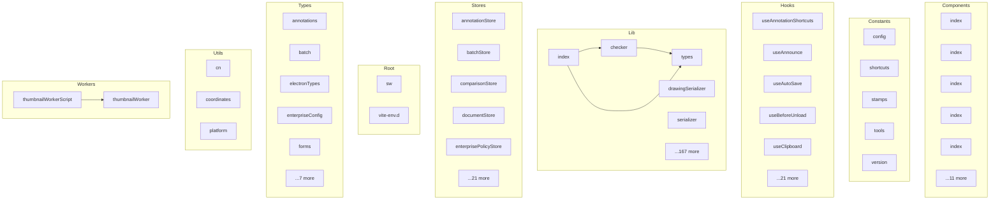

# paperflow - Dependency Graph

**Version**: 3.0.0-alpha.1 | **Last Updated**: 2026-02-03

This document provides a comprehensive dependency graph of all files, components, imports, functions, and variables in the codebase.

---

## Table of Contents

1. [Overview](#overview)
2. [Components Dependencies](#components-dependencies)
3. [Constants Dependencies](#constants-dependencies)
4. [Hooks Dependencies](#hooks-dependencies)
5. [Lib Dependencies](#lib-dependencies)
6. [Stores Dependencies](#stores-dependencies)
7. [Root Dependencies](#root-dependencies)
8. [Types Dependencies](#types-dependencies)
9. [Utils Dependencies](#utils-dependencies)
10. [Workers Dependencies](#workers-dependencies)
11. [Dependency Matrix](#dependency-matrix)
12. [Circular Dependency Analysis](#circular-dependency-analysis)
13. [Visual Dependency Graph](#visual-dependency-graph)
14. [Summary Statistics](#summary-statistics)

---

## Overview

The codebase is organized into the following modules:

- **components**: 16 files
- **constants**: 5 files
- **hooks**: 26 files
- **lib**: 172 files
- **stores**: 26 files
- **root**: 2 files
- **types**: 12 files
- **utils**: 3 files
- **workers**: 2 files

---

## Components Dependencies

### `src/components/accessibility/index.ts` - index module

**Internal Dependencies:**
| File | Imports | Type |
|------|---------|------|
| `./AccessibilityPanel` | `AccessibilityPanel` | Re-export |
| `./IssueList` | `IssueList` | Re-export |
| `./AccessibilityReport` | `AccessibilityReport` | Re-export |

**Exports:**
- Re-exports: `AccessibilityPanel`, `IssueList`, `AccessibilityReport`

---

### `src/components/annotations/index.ts` - Annotation layer

**Internal Dependencies:**
| File | Imports | Type |
|------|---------|------|
| `./AnnotationLayer` | `AnnotationLayer` | Re-export |
| `./Highlight` | `Highlight` | Re-export |
| `./Underline` | `Underline` | Re-export |
| `./Strikethrough` | `Strikethrough` | Re-export |
| `./StickyNote` | `StickyNote, NOTE_COLORS` | Re-export |
| `./NoteReplies` | `NoteReplies` | Re-export |
| `./NoteTool` | `NoteTool` | Re-export |
| `./HighlightTool` | `HighlightTool, HIGHLIGHT_TOOL_COLORS` | Re-export |
| `@hooks/useHighlightTool` | `useHighlightTool` | Re-export |
| `./SelectionPopup` | `SelectionPopup, HIGHLIGHT_COLORS` | Re-export |
| `./OpacitySlider` | `OpacitySlider` | Re-export |
| `./AnnotationProperties` | `AnnotationProperties` | Re-export |
| `./ExportImportDialog` | `ExportImportDialog` | Re-export |

**Exports:**
- Re-exports: `AnnotationLayer`, `Highlight`, `Underline`, `Strikethrough`, `StickyNote`, `NOTE_COLORS`, `NoteReplies`, `NoteTool`, `HighlightTool`, `HIGHLIGHT_TOOL_COLORS`, `useHighlightTool`, `SelectionPopup`, `HIGHLIGHT_COLORS`, `OpacitySlider`, `AnnotationProperties`, `ExportImportDialog`

---

### `src/components/batch/index.ts` - index module

**Internal Dependencies:**
| File | Imports | Type |
|------|---------|------|
| `./BatchPanel` | `BatchPanel` | Re-export |
| `./WatermarkDialog` | `WatermarkDialog` | Re-export |
| `./HeaderFooterDialog` | `HeaderFooterDialog` | Re-export |
| `./BatesNumberDialog` | `BatesNumberDialog` | Re-export |
| `./FlattenDialog` | `FlattenDialog` | Re-export |

**Exports:**
- Re-exports: `BatchPanel`, `WatermarkDialog`, `HeaderFooterDialog`, `BatesNumberDialog`, `FlattenDialog`

---

### `src/components/comparison/index.ts` - index module

**Internal Dependencies:**
| File | Imports | Type |
|------|---------|------|
| `./ComparisonDialog` | `ComparisonDialog` | Re-export |
| `./SideBySideView` | `SideBySideView` | Re-export |
| `./OverlayView` | `OverlayView` | Re-export |
| `./ComparisonReport` | `ComparisonReport` | Re-export |

**Exports:**
- Re-exports: `ComparisonDialog`, `SideBySideView`, `OverlayView`, `ComparisonReport`

---

### `src/components/editor/index.ts` - Text editing components for Sprint 7

**Internal Dependencies:**
| File | Imports | Type |
|------|---------|------|
| `./TextSelector` | `TextSelector, type TextSelectorSelection` | Re-export |
| `./TextProperties` | `TextProperties` | Re-export |
| `./InlineTextEditor` | `InlineTextEditor` | Re-export |
| `./TextBoxTool` | `TextBoxTool` | Re-export |
| `./TextBoxTransform` | `TextBoxTransform` | Re-export |
| `./RichTextToolbar` | `RichTextToolbar` | Re-export |
| `./FontPicker` | `FontPicker` | Re-export |
| `./FontSizePicker` | `FontSizePicker` | Re-export |
| `./TextColorPicker` | `TextColorPicker` | Re-export |
| `./AlignmentPicker` | `AlignmentPicker` | Re-export |
| `./LineSpacing` | `LineSpacing` | Re-export |

**Exports:**
- Re-exports: `TextSelector`, `type TextSelectorSelection`, `TextProperties`, `InlineTextEditor`, `TextBoxTool`, `TextBoxTransform`, `RichTextToolbar`, `FontPicker`, `FontSizePicker`, `TextColorPicker`, `AlignmentPicker`, `LineSpacing`

---

### `src/components/export/index.ts` - index module

**Internal Dependencies:**
| File | Imports | Type |
|------|---------|------|
| `./ImageExportDialog` | `ImageExportDialog` | Re-export |
| `./CompressDialog` | `CompressDialog` | Re-export |

**Exports:**
- Re-exports: `ImageExportDialog`, `CompressDialog`

---

### `src/components/forms/designer/index.ts` - Form Designer Components

**Internal Dependencies:**
| File | Imports | Type |
|------|---------|------|
| `./FormDesigner` | `FormDesigner` | Re-export |
| `./FieldPalette` | `FieldPalette` | Re-export |
| `./DesignCanvas` | `DesignCanvas` | Re-export |
| `./FieldProperties` | `FieldProperties` | Re-export |
| `./FieldPreview` | `FieldPreview` | Re-export |
| `./DesignerToolbar` | `DesignerToolbar` | Re-export |

**Exports:**
- Re-exports: `FormDesigner`, `FieldPalette`, `DesignCanvas`, `FieldProperties`, `FieldPreview`, `DesignerToolbar`

---

### `src/components/forms/index.ts` - index module

**Internal Dependencies:**
| File | Imports | Type |
|------|---------|------|
| `./TextField` | `TextField` | Re-export |
| `./Checkbox` | `Checkbox` | Re-export |
| `./RadioButton` | `RadioButton, RadioGroup` | Re-export |
| `./Dropdown` | `Dropdown` | Re-export |
| `./FormFieldRenderer` | `FormFieldRenderer` | Re-export |
| `./FormLayer` | `FormLayer` | Re-export |
| `./FormActions` | `FormActions` | Re-export |
| `./FieldError` | `FieldError, FieldErrorTooltip, RequiredIndicator` | Re-export |

**Exports:**
- Re-exports: `TextField`, `Checkbox`, `RadioButton`, `RadioGroup`, `Dropdown`, `FormFieldRenderer`, `FormLayer`, `FormActions`, `FieldError`, `FieldErrorTooltip`, `RequiredIndicator`

---

### `src/components/lazy/index.ts` - Lazy-loaded heavy feature components

**External Dependencies:**
| Package | Import |
|---------|--------|
| `react` | `lazy` |

**Exports:**
- Constants: `LazySignatureModal`, `LazyDrawingCanvas`, `LazyImageExportDialog`, `LazyCompressDialog`, `LazyPrintDialog`, `LazyMergeDialog`, `LazySplitDialog`

---

### `src/components/ocr/index.ts` - OCR Components

**Internal Dependencies:**
| File | Imports | Type |
|------|---------|------|
| `./OCRDialog` | `OCRDialog` | Re-export |
| `./LanguageSelector` | `LanguageSelector` | Re-export |
| `./OCRProgress` | `OCRProgress` | Re-export |
| `./PageRangeSelector` | `PageRangeSelector` | Re-export |
| `./PreprocessingOptions` | `PreprocessingOptions` | Re-export |
| `./OCRResultsPanel` | `OCRResultsPanel` | Re-export |
| `./BatchOCRProgress` | `BatchOCRProgress` | Re-export |
| `./OCRExportDialog` | `OCRExportDialog` | Re-export |

**Exports:**
- Re-exports: `OCRDialog`, `LanguageSelector`, `OCRProgress`, `PageRangeSelector`, `PreprocessingOptions`, `OCRResultsPanel`, `BatchOCRProgress`, `OCRExportDialog`

---

### `src/components/pages/index.ts` - index module

**Internal Dependencies:**
| File | Imports | Type |
|------|---------|------|
| `./DraggableThumbnail` | `DraggableThumbnail` | Re-export |
| `./PageContextMenu` | `PageContextMenu` | Re-export |
| `./MoveToDialog` | `MoveToDialog` | Re-export |
| `./InsertPageDialog` | `InsertPageDialog` | Re-export |
| `./MergeDialog` | `MergeDialog` | Re-export |
| `./SplitDialog` | `SplitDialog` | Re-export |
| `./RotateMenu` | `RotateMenu` | Re-export |

**Exports:**
- Re-exports: `DraggableThumbnail`, `PageContextMenu`, `MoveToDialog`, `InsertPageDialog`, `MergeDialog`, `SplitDialog`, `RotateMenu`

---

### `src/components/print/index.ts` - index module

**Internal Dependencies:**
| File | Imports | Type |
|------|---------|------|
| `./PrintDialog` | `PrintDialog` | Re-export |
| `./PrintPreview` | `PrintPreview` | Re-export |
| `./PageRangeSelector` | `PageRangeSelector, type PageRangeType` | Re-export |
| `./ScaleOptions` | `ScaleOptions, type ScaleType` | Re-export |
| `./OrientationOptions` | `OrientationOptions, type Orientation` | Re-export |

**Exports:**
- Re-exports: `PrintDialog`, `PrintPreview`, `PageRangeSelector`, `type PageRangeType`, `ScaleOptions`, `type ScaleType`, `OrientationOptions`, `type Orientation`

---

### `src/components/redaction/index.ts` - index module

**Internal Dependencies:**
| File | Imports | Type |
|------|---------|------|
| `./RedactionToolbar` | `RedactionToolbar` | Re-export |
| `./PatternSearchDialog` | `PatternSearchDialog` | Re-export |
| `./RedactionVerify` | `RedactionVerify` | Re-export |

**Exports:**
- Re-exports: `RedactionToolbar`, `PatternSearchDialog`, `RedactionVerify`

---

### `src/components/signatures/index.ts` - Signature creation components

**Internal Dependencies:**
| File | Imports | Type |
|------|---------|------|
| `./DrawSignature` | `DrawSignature` | Re-export |
| `./TypeSignature` | `TypeSignature` | Re-export |
| `./ImageSignature` | `ImageSignature` | Re-export |
| `./SignatureModal` | `SignatureModal` | Re-export |
| `./InitialsModal` | `InitialsModal` | Re-export |
| `./SignatureList` | `SignatureList` | Re-export |
| `./SignaturePlacer` | `SignaturePlacer` | Re-export |
| `./SignatureResize` | `SignatureResize` | Re-export |
| `./SignatureRotation` | `SignatureRotation` | Re-export |
| `./DateStamp` | `DateStamp` | Re-export |

**Exports:**
- Re-exports: `DrawSignature`, `TypeSignature`, `ImageSignature`, `SignatureModal`, `InitialsModal`, `SignatureList`, `SignaturePlacer`, `SignatureResize`, `SignatureRotation`, `DateStamp`

---

### `src/components/ui/index.ts` - index module

**Internal Dependencies:**
| File | Imports | Type |
|------|---------|------|
| `./Button` | `Button, type ButtonProps` | Re-export |
| `./ThemeToggle` | `ThemeToggle, ThemeSelector` | Re-export |
| `./Checkbox` | `Checkbox, type CheckboxProps` | Re-export |
| `./Input` | `Input, type InputProps` | Re-export |
| `./Select` | `Select, type SelectProps` | Re-export |
| `./Progress` | `Progress, type ProgressProps` | Re-export |
| `./Dialog` | `Dialog, DialogTrigger, DialogContent, DialogHeader, DialogFooter, DialogTitle, DialogDescription, DialogClose` | Re-export |

**Exports:**
- Re-exports: `Button`, `type ButtonProps`, `ThemeToggle`, `ThemeSelector`, `Checkbox`, `type CheckboxProps`, `Input`, `type InputProps`, `Select`, `type SelectProps`, `Progress`, `type ProgressProps`, `Dialog`, `DialogTrigger`, `DialogContent`, `DialogHeader`, `DialogFooter`, `DialogTitle`, `DialogDescription`, `DialogClose`

---

### `src/components/update/index.ts` - Update Components Index

**Internal Dependencies:**
| File | Imports | Type |
|------|---------|------|
| `./UpdateNotification` | `UpdateNotification, UpdateErrorNotification` | Re-export |
| `./UpdateProgress` | `UpdateProgress, UpdateProgressIndicator` | Re-export |
| `./ReleaseNotes` | `ReleaseNotes` | Re-export |
| `./InstallPrompt` | `InstallPrompt` | Re-export |
| `./UpdateSettings` | `UpdateSettings` | Re-export |

**Exports:**
- Re-exports: `UpdateNotification`, `UpdateErrorNotification`, `UpdateProgress`, `UpdateProgressIndicator`, `ReleaseNotes`, `InstallPrompt`, `UpdateSettings`

---

## Constants Dependencies

### `src/constants/config.ts` - config module

**Exports:**
- Constants: `APP_CONFIG`, `PDF_CONFIG`, `STORAGE_KEYS`, `SUPPORTED_FORMATS`, `BREAKPOINTS`

---

### `src/constants/shortcuts.ts` - shortcuts module

**Exports:**
- Interfaces: `KeyboardShortcut`
- Functions: `matchShortcut`
- Constants: `KEYBOARD_SHORTCUTS`

---

### `src/constants/stamps.ts` - Preset stamps for document workflows.

**Exports:**
- Interfaces: `PresetStamp`
- Functions: `getStampById`
- Constants: `PRESET_STAMPS`, `DEFAULT_STAMP_WIDTH`, `DEFAULT_STAMP_HEIGHT`

---

### `src/constants/tools.ts` - tools module

**Exports:**
- Constants: `TOOL_IDS`, `HIGHLIGHT_COLORS`, `DRAWING_COLORS`, `NOTE_COLORS`, `STAMP_TYPES`

---

### `src/constants/version.ts` - Version Constants

**Exports:**
- Functions: `parseVersion`, `compareVersions`, `isPrerelease`, `getDisplayVersion`
- Constants: `APP_VERSION`, `APP_NAME`, `APP_DESCRIPTION`, `RELEASE_CHANNEL`, `BUILD_DATE`, `COPYRIGHT`, `VERSION_INFO`

---

## Hooks Dependencies

### `src/hooks/useAnnotationShortcuts.ts` - Hook for handling annotation keyboard shortcuts.

**External Dependencies:**
| Package | Import |
|---------|--------|
| `react` | `useEffect, useCallback` |
| `@stores/annotationStore` | `useAnnotationStore` |
| `@stores/historyStore` | `useHistoryStore` |
| `@/types` | `AnnotationType` |

**Exports:**
- Functions: `useAnnotationShortcuts`

---

### `src/hooks/useAnnounce.ts` - Announce a message to screen readers programmatically.

**External Dependencies:**
| Package | Import |
|---------|--------|
| `react` | `useRef, useCallback, useEffect` |

**Exports:**
- Functions: `useAnnounce`

---

### `src/hooks/useAutoSave.ts` - Hook to check for and recover auto-saved documents

**External Dependencies:**
| Package | Import |
|---------|--------|
| `react` | `useEffect, useRef, useCallback` |
| `@lib/storage/indexeddb` | `storage` |
| `@stores/documentStore` | `useDocumentStore` |
| `@stores/settingsStore` | `useSettingsStore` |
| `@lib/pdf/saver` | `savePdf` |

**Exports:**
- Functions: `useAutoSave`, `useAutoSaveRecovery`

---

### `src/hooks/useBeforeUnload.ts` - Hook that shows a browser confirmation dialog when attempting to leave

**External Dependencies:**
| Package | Import |
|---------|--------|
| `react` | `useEffect, useCallback` |

**Exports:**
- Functions: `useBeforeUnload`, `useBeforeUnloadCallback`

---

### `src/hooks/useClipboard.ts` - Hook for clipboard operations with support for both modern and legacy APIs.

**External Dependencies:**
| Package | Import |
|---------|--------|
| `react` | `useState, useCallback` |

**Exports:**
- Functions: `useClipboard`, `copyToClipboard`

---

### `src/hooks/useConnectionStatus.ts` - Connection Status Hook

**External Dependencies:**
| Package | Import |
|---------|--------|
| `react` | `useState, useEffect, useRef` |
| `@/stores/offlineStore` | `useOfflineStore, initializeOfflineListeners` |
| `@/types/offline` | `ConnectionStatus, NetworkStatusInfo` |

**Exports:**
- Functions: `useConnectionStatus`, `useIsOnline`, `useOnReconnect`, `useOnDisconnect`

---

### `src/hooks/useDropZone.ts` - useDropZone module

**External Dependencies:**
| Package | Import |
|---------|--------|
| `react` | `useState, useCallback, useRef, useEffect` |

**Exports:**
- Functions: `useDropZone`

---

### `src/hooks/useFileSystem.ts` - useFileSystem module

**External Dependencies:**
| Package | Import |
|---------|--------|
| `react` | `useState, useCallback, useRef` |
| `react-router-dom` | `useNavigate` |
| `@stores/documentStore` | `useDocumentStore` |
| `@lib/storage/fileHandler` | `openPdfFile, savePdfFile, savePdfFileAs, downloadPdf, fetchPdfFromUrl, isFileSystemAccessSupported` |

**Exports:**
- Functions: `useFileSystem`

---

### `src/hooks/useFormFields.ts` - Hook to extract and manage form fields from the loaded PDF document

**External Dependencies:**
| Package | Import |
|---------|--------|
| `react` | `useEffect, useCallback` |
| `@stores/documentStore` | `useDocumentStore` |
| `@stores/formStore` | `useFormStore` |
| `@stores/settingsStore` | `useSettingsStore` |
| `@lib/forms/formParser` | `extractPageFormFields, sortFieldsByTabOrder` |
| `@lib/storage/formStorage` | `loadFormData, saveFormData` |
| `@/types/forms` | `FormField` |

**Exports:**
- Functions: `useFormFields`

---

### `src/hooks/useFormNavigation.ts` - Hook for managing form field navigation (Tab/Shift+Tab)

**External Dependencies:**
| Package | Import |
|---------|--------|
| `react` | `useCallback, useEffect` |
| `@stores/formStore` | `useFormStore` |
| `@stores/settingsStore` | `useSettingsStore` |
| `@stores/documentStore` | `useDocumentStore` |

**Exports:**
- Functions: `useFormNavigation`

---

### `src/hooks/useHighlightTool.ts` - Hook for using highlight tool functionality programmatically.

**External Dependencies:**
| Package | Import |
|---------|--------|
| `react` | `useCallback` |
| `@stores/annotationStore` | `useAnnotationStore` |
| `@stores/historyStore` | `useHistoryStore` |
| `@/types` | `AnnotationRect, Annotation` |

**Exports:**
- Functions: `useHighlightTool`

---

### `src/hooks/useKeyboardNavigation.ts` - Hook for keyboard navigation support.

**External Dependencies:**
| Package | Import |
|---------|--------|
| `react` | `useEffect, useCallback` |

**Exports:**
- Functions: `useKeyboardNavigation`, `useFocusTrap`

---

### `src/hooks/useOfflineData.ts` - Offline-First Data Hook

**External Dependencies:**
| Package | Import |
|---------|--------|
| `react` | `useState, useEffect, useCallback, useRef` |
| `@/stores/offlineStore` | `useOfflineStore` |
| `@/lib/offline/offlineStorage` | `offlineStorage` |
| `@/lib/offline/offlineQueue` | `offlineQueue` |
| `@/types/offline` | `OfflineDocument, OfflineDocumentMetadata` |

**Exports:**
- Functions: `useOfflineData`, `useOfflineDocument`, `useOfflineDocuments`

---

### `src/hooks/useOfflineSync.ts` - Offline Sync Hook

**External Dependencies:**
| Package | Import |
|---------|--------|
| `react` | `useState, useEffect, useCallback` |
| `@/stores/offlineStore` | `useOfflineStore` |
| `@/lib/offline/syncEngine` | `syncEngine, SyncResult` |
| `@/lib/offline/backgroundSync` | `backgroundSync, getSyncStatus` |
| `@/lib/offline/offlineQueue` | `offlineQueue` |
| `@/types/offline` | `SyncProgress, SyncConflict, ConflictResolutionStrategy` |

**Exports:**
- Functions: `useOfflineSync`

---

### `src/hooks/usePageDrag.ts` - Hook for managing drag-and-drop page reordering

**External Dependencies:**
| Package | Import |
|---------|--------|
| `react` | `useCallback, useState, useRef` |

**Exports:**
- Interfaces: `DragState`, `UsePageDragOptions`, `UsePageDragReturn`
- Functions: `usePageDrag`

---

### `src/hooks/usePageSelection.ts` - Hook for managing multi-page selection with support for

**External Dependencies:**
| Package | Import |
|---------|--------|
| `react` | `useCallback, useState` |

**Exports:**
- Interfaces: `UsePageSelectionOptions`, `UsePageSelectionReturn`
- Functions: `usePageSelection`

---

### `src/hooks/usePlatform.ts` - usePlatform Hook

**External Dependencies:**
| Package | Import |
|---------|--------|
| `react` | `useState, useEffect, useMemo` |
| `@lib/electron/platform` | `isElectron, isBrowser, isWindows, isMacOS, isLinux, getPlatformInfo, getAppVersion, isFeatureAvailable, getCommandKey, getAltKey, formatShortcut, initializePlatform, PlatformFeature` |
| `@/types/electronTypes` | `PlatformInfo` |

**Exports:**
- Interfaces: `ElectronMenuEventHandlers`
- Functions: `usePlatform`, `useElectronMenuEvents`

---

### `src/hooks/usePointerInput.ts` - Hook for unified pointer input handling (mouse, touch, stylus).

**External Dependencies:**
| Package | Import |
|---------|--------|
| `react` | `useCallback, useRef, useState` |

**Exports:**
- Interfaces: `PointerPoint`, `UsePointerInputOptions`, `UsePointerInputResult`
- Functions: `usePointerInput`

---

### `src/hooks/useSearch.ts` - useSearch module

**External Dependencies:**
| Package | Import |
|---------|--------|
| `react` | `useState, useCallback, useRef, useEffect` |
| `@lib/pdf/renderer` | `PDFRenderer` |

**Exports:**
- Interfaces: `SearchMatch`, `SearchOptions`
- Functions: `useSearch`

---

### `src/hooks/useSignatureInput.ts` - Hook for handling mouse, touch, and stylus input for signature drawing.

**External Dependencies:**
| Package | Import |
|---------|--------|
| `react` | `useCallback, useRef, useState` |

**Exports:**
- Functions: `useSignatureInput`

---

### `src/hooks/useTextSelection.ts` - Hook for capturing and managing text selections.

**External Dependencies:**
| Package | Import |
|---------|--------|
| `react` | `useState, useCallback, useEffect` |
| `@/types` | `AnnotationRect` |

**Exports:**
- Interfaces: `TextSelectionData`
- Functions: `useTextSelection`

---

### `src/hooks/useThumbnails.ts` - Hook for lazy loading thumbnails using IntersectionObserver

**External Dependencies:**
| Package | Import |
|---------|--------|
| `react` | `useState, useCallback, useRef, useEffect` |
| `@lib/pdf/renderer` | `PDFRenderer` |

**Exports:**
- Functions: `useThumbnails`, `useLazyThumbnails`

---

### `src/hooks/useTouchGestures.ts` - useTouchGestures module

**External Dependencies:**
| Package | Import |
|---------|--------|
| `react` | `useRef, useCallback, useEffect` |

**Exports:**
- Functions: `useTouchGestures`

---

### `src/hooks/useUnsavedChanges.ts` - Unsaved Changes Hook

**External Dependencies:**
| Package | Import |
|---------|--------|
| `react` | `useEffect, useCallback, useRef` |
| `@stores/documentStore` | `useDocumentStore` |
| `@lib/electron/platform` | `isElectron` |

**Exports:**
- Functions: `useUnsavedChanges`, `useDocumentModified`

---

### `src/hooks/useVirtualization.ts` - More flexible virtualization hook that supports variable item heights

**External Dependencies:**
| Package | Import |
|---------|--------|
| `react` | `useState, useCallback, useRef, useMemo` |

**Exports:**
- Functions: `useVirtualization`, `useDynamicVirtualization`

---

### `src/hooks/useVisiblePages.ts` - Track which pages are currently visible in the viewport using IntersectionObserver.

**External Dependencies:**
| Package | Import |
|---------|--------|
| `react` | `useState, useCallback, useRef, useMemo, useEffect` |

**Exports:**
- Interfaces: `VisiblePage`
- Functions: `useVisiblePages`

---

## Lib Dependencies

### `src/lib/accessibility/checker.ts` - PDF Accessibility Checker

**Internal Dependencies:**
| File | Imports | Type |
|------|---------|------|
| `./types` | `AccessibilityIssue, CheckResult, CheckType, CheckCategory, IssueSeverity, AccessibilityReport, PageAccessibility, CheckerConfig` | Import (type-only) |
| `./types` | `WCAG_CRITERIA, PDFUA_REQUIREMENTS, DEFAULT_CHECKER_CONFIG` | Import |

**Exports:**
- Functions: `createIssue`, `getCheckDescription`, `createCheckResult`, `checkDocumentTitle`, `checkDocumentLanguage`, `checkTaggedPdf`, `checkImageAltText`, `checkFormFieldLabels`, `checkLinkText`, `checkTableHeaders`, `calculateContrastRatio`, `checkColorContrast`, `checkHeadingStructure`, `createAccessibilityReport`, `calculateAccessibilityScore`, `determineWcagLevel`, `mergeCheckerConfig`, `getIssuesBySeverity`, `getIssuesByCategory`, `getIssuesByPage`, `generateReportSummary`

---

### `src/lib/accessibility/index.ts` - PDF Accessibility Module

**Internal Dependencies:**
| File | Imports | Type |
|------|---------|------|
| `./types` | `DEFAULT_CHECKER_CONFIG, WCAG_CRITERIA, PDFUA_REQUIREMENTS, CATEGORY_CHECKS` | Re-export |
| `./checker` | `createIssue, getCheckDescription, createCheckResult, checkDocumentTitle, checkDocumentLanguage, checkTaggedPdf, checkImageAltText, checkFormFieldLabels, checkLinkText, checkTableHeaders, calculateContrastRatio, checkColorContrast, checkHeadingStructure, createAccessibilityReport, calculateAccessibilityScore, determineWcagLevel, mergeCheckerConfig, getIssuesBySeverity, getIssuesByCategory, getIssuesByPage, generateReportSummary` | Re-export |

**Exports:**
- Re-exports: `DEFAULT_CHECKER_CONFIG`, `WCAG_CRITERIA`, `PDFUA_REQUIREMENTS`, `CATEGORY_CHECKS`, `createIssue`, `getCheckDescription`, `createCheckResult`, `checkDocumentTitle`, `checkDocumentLanguage`, `checkTaggedPdf`, `checkImageAltText`, `checkFormFieldLabels`, `checkLinkText`, `checkTableHeaders`, `calculateContrastRatio`, `checkColorContrast`, `checkHeadingStructure`, `createAccessibilityReport`, `calculateAccessibilityScore`, `determineWcagLevel`, `mergeCheckerConfig`, `getIssuesBySeverity`, `getIssuesByCategory`, `getIssuesByPage`, `generateReportSummary`

---

### `src/lib/accessibility/types.ts` - PDF Accessibility Types

**Exports:**
- Interfaces: `AccessibilityIssue`, `CheckResult`, `PageAccessibility`, `AccessibilityReport`, `CheckerConfig`
- Constants: `DEFAULT_CHECKER_CONFIG`, `WCAG_CRITERIA`, `PDFUA_REQUIREMENTS`, `CATEGORY_CHECKS`

---

### `src/lib/annotations/drawingSerializer.ts` - Drawing path serialization utilities.

**Exports:**
- Interfaces: `SerializedPoint`, `SerializedDrawingPath`, `SerializedDrawing`
- Functions: `serializeDrawingPaths`, `deserializeDrawingPaths`, `simplifyPath`, `calculateDrawingBounds`, `validateDrawingPaths`, `mergeDrawingPaths`, `cloneDrawingPaths`

---

### `src/lib/annotations/serializer.ts` - Annotation serialization format version.

**External Dependencies:**
| Package | Import |
|---------|--------|
| `@/types` | `Annotation, AnnotationReply, AnnotationRect` |

**Exports:**
- Interfaces: `SerializedAnnotation`, `SerializedReply`, `AnnotationExport`
- Functions: `serializeAnnotation`, `serializeReply`, `deserializeAnnotation`, `deserializeReply`, `exportAnnotations`, `importAnnotations`, `validateAnnotationData`, `generateAnnotationId`, `mergeAnnotations`
- Constants: `ANNOTATION_FORMAT_VERSION`

---

### `src/lib/batch/batchProcessor.ts` - Batch Processor

**Internal Dependencies:**
| File | Imports | Type |
|------|---------|------|
| `./types` | `BatchOperation, BatchOperationType, BatchOperationStatus, BatchProgress, BatchResult, WatermarkOptions, HeaderFooterOptions` | Import (type-only) |

**Exports:**
- Functions: `createBatchOperation`, `updateOperationStatus`, `calculateBatchProgress`, `sortOperationsByPriority`, `getNextPendingOperation`, `isBatchComplete`, `hasFailedOperations`, `getFailedOperations`, `createBatchResult`, `validateOperationOptions`, `estimateOperationTime`, `generateOperationSummary`, `cancelPendingOperations`, `resetFailedOperations`, `groupOperationsByType`

---

### `src/lib/batch/batesNumber.ts` - Bates Numbering Module

**Internal Dependencies:**
| File | Imports | Type |
|------|---------|------|
| `./types` | `PageRange, FontConfig, Margins` | Import (type-only) |
| `./types` | `DEFAULT_FONT_CONFIG, DEFAULT_MARGINS` | Import |

**Exports:**
- Interfaces: `BatesNumberOptions`, `BatesState`
- Functions: `formatBatesNumber`, `getNextBatesNumber`, `createBatesState`, `resetBatesState`, `calculateBatesPosition`, `estimateBatesTextDimensions`, `validateBatesOptions`, `mergeBatesOptions`, `generateBatesPreview`, `calculateLastBatesNumber`, `parseBatesNumber`, `createBatesOperationData`, `getBatesPreset`, `shouldApplyBatesToPage`
- Constants: `DEFAULT_BATES_OPTIONS`, `BATES_PRESETS`

---

### `src/lib/batch/errorHandler.ts` - Batch Error Handler

**External Dependencies:**
| Package | Import |
|---------|--------|
| `@/types/batch` | `BatchJob, BatchFile, BatchFileError, ErrorStrategy` |

**Exports:**
- Classes: `BatchErrorCollector`
- Functions: `isRecoverableError`, `parseError`, `createBatchFileError`, `handleError`, `calculateRetryDelay`, `getUserFriendlyMessage`, `getSuggestedAction`, `createErrorCollector`
- Constants: `ERROR_CODES`

---

### `src/lib/batch/errorReporter.ts` - Batch Error Reporter

**External Dependencies:**
| Package | Import |
|---------|--------|
| `@/types/batch` | `BatchJob, BatchFileError, BatchJobResult, OutputFileInfo` |

**Internal Dependencies:**
| File | Imports | Type |
|------|---------|------|
| `./errorHandler` | `getUserFriendlyMessage, getSuggestedAction, ErrorCode` | Import |

**Exports:**
- Interfaces: `BatchErrorReport`, `BatchReportSummary`, `BatchReportDetails`, `BatchReportExport`
- Functions: `generateErrorReport`, `createQuickReport`, `downloadReport`

---

### `src/lib/batch/flatten.ts` - PDF Flatten Module

**Internal Dependencies:**
| File | Imports | Type |
|------|---------|------|
| `./types` | `PageRange` | Import (type-only) |

**Exports:**
- Interfaces: `FlattenOptions`, `PageFlattenResult`, `FlattenStats`
- Functions: `createEmptyFlattenStats`, `updateFlattenStats`, `shouldFlattenTarget`, `validateFlattenOptions`, `mergeFlattenOptions`, `generateFlattenSummary`, `shouldFlattenPage`, `estimateSizeReduction`, `createPageFlattenResult`, `getFlattenPreset`, `getTotalItemsFlattened`, `isFlattenComplete`, `calculateFlattenProgress`
- Constants: `DEFAULT_FLATTEN_OPTIONS`, `FLATTEN_PRESETS`

---

### `src/lib/batch/headerFooter.ts` - Header/Footer Module

**Internal Dependencies:**
| File | Imports | Type |
|------|---------|------|
| `./types` | `HeaderFooterOptions, HeaderFooterSection, PageNumberFormat, PageRange, FontConfig, Position` | Import (type-only) |
| `./types` | `DEFAULT_HEADER_FOOTER_OPTIONS, DEFAULT_FONT_CONFIG` | Import |
| `./watermark` | `getApplicablePages, parseColor` | Import |

**Exports:**
- Functions: `formatPageNumber`, `toRomanNumeral`, `toLetterNumeral`, `substituteVariables`, `createVariableContext`, `calculateSectionPosition`, `validateHeaderFooterOptions`, `mergeHeaderFooterOptions`, `shouldApplyToPage`, `approximateTextWidth`, `createHeaderFooterOperationData`, `parsePageRangeString`, `createPreset`

---

### `src/lib/batch/index.ts` - Batch Processing Module

**Internal Dependencies:**
| File | Imports | Type |
|------|---------|------|
| `./types` | `DEFAULT_FONT_CONFIG, DEFAULT_MARGINS, DEFAULT_WATERMARK_OPTIONS, WATERMARK_TEMPLATES, DEFAULT_HEADER_FOOTER_OPTIONS, HEADER_FOOTER_VARIABLES` | Re-export |
| `./watermark` | `calculatePositionFromPreset, getApplicablePages, calculateTextDimensions, generateTilePositions, applyRotation, parseColor, validateWatermarkOptions, mergeWatermarkOptions, createWatermarkOperationData, getWatermarkTemplate, createCustomTemplate` | Re-export |
| `./headerFooter` | `formatPageNumber, toRomanNumeral, toLetterNumeral, substituteVariables, createVariableContext, calculateSectionPosition, validateHeaderFooterOptions, mergeHeaderFooterOptions, shouldApplyToPage, approximateTextWidth, createHeaderFooterOperationData, parsePageRangeString, createPreset` | Re-export |
| `./batchProcessor` | `createBatchOperation, updateOperationStatus, calculateBatchProgress, sortOperationsByPriority, getNextPendingOperation, isBatchComplete, hasFailedOperations, getFailedOperations, createBatchResult, validateOperationOptions, estimateOperationTime, generateOperationSummary, cancelPendingOperations, resetFailedOperations, groupOperationsByType` | Re-export |
| `./batesNumber` | `formatBatesNumber, getNextBatesNumber, createBatesState, resetBatesState, calculateBatesPosition, estimateBatesTextDimensions, validateBatesOptions, mergeBatesOptions, generateBatesPreview, calculateLastBatesNumber, parseBatesNumber, createBatesOperationData, getBatesPreset, shouldApplyBatesToPage, BATES_PRESETS, DEFAULT_BATES_OPTIONS` | Re-export |
| `./flatten` | `createEmptyFlattenStats, updateFlattenStats, shouldFlattenTarget, validateFlattenOptions, mergeFlattenOptions, generateFlattenSummary, shouldFlattenPage, estimateSizeReduction, createPageFlattenResult, getFlattenPreset, getTotalItemsFlattened, isFlattenComplete, calculateFlattenProgress, FLATTEN_PRESETS, DEFAULT_FLATTEN_OPTIONS` | Re-export |

**Exports:**
- Re-exports: `DEFAULT_FONT_CONFIG`, `DEFAULT_MARGINS`, `DEFAULT_WATERMARK_OPTIONS`, `WATERMARK_TEMPLATES`, `DEFAULT_HEADER_FOOTER_OPTIONS`, `HEADER_FOOTER_VARIABLES`, `calculatePositionFromPreset`, `getApplicablePages`, `calculateTextDimensions`, `generateTilePositions`, `applyRotation`, `parseColor`, `validateWatermarkOptions`, `mergeWatermarkOptions`, `createWatermarkOperationData`, `getWatermarkTemplate`, `createCustomTemplate`, `formatPageNumber`, `toRomanNumeral`, `toLetterNumeral`, `substituteVariables`, `createVariableContext`, `calculateSectionPosition`, `validateHeaderFooterOptions`, `mergeHeaderFooterOptions`, `shouldApplyToPage`, `approximateTextWidth`, `createHeaderFooterOperationData`, `parsePageRangeString`, `createPreset`, `createBatchOperation`, `updateOperationStatus`, `calculateBatchProgress`, `sortOperationsByPriority`, `getNextPendingOperation`, `isBatchComplete`, `hasFailedOperations`, `getFailedOperations`, `createBatchResult`, `validateOperationOptions`, `estimateOperationTime`, `generateOperationSummary`, `cancelPendingOperations`, `resetFailedOperations`, `groupOperationsByType`, `formatBatesNumber`, `getNextBatesNumber`, `createBatesState`, `resetBatesState`, `calculateBatesPosition`, `estimateBatesTextDimensions`, `validateBatesOptions`, `mergeBatesOptions`, `generateBatesPreview`, `calculateLastBatesNumber`, `parseBatesNumber`, `createBatesOperationData`, `getBatesPreset`, `shouldApplyBatesToPage`, `BATES_PRESETS`, `DEFAULT_BATES_OPTIONS`, `createEmptyFlattenStats`, `updateFlattenStats`, `shouldFlattenTarget`, `validateFlattenOptions`, `mergeFlattenOptions`, `generateFlattenSummary`, `shouldFlattenPage`, `estimateSizeReduction`, `createPageFlattenResult`, `getFlattenPreset`, `getTotalItemsFlattened`, `isFlattenComplete`, `calculateFlattenProgress`, `FLATTEN_PRESETS`, `DEFAULT_FLATTEN_OPTIONS`

---

### `src/lib/batch/jobPersistence.ts` - Batch Job Persistence

**External Dependencies:**
| Package | Import |
|---------|--------|
| `@/types/batch` | `BatchJob, BatchTemplate` |

**Exports:**
- Functions: `saveJob`, `loadJob`, `loadAllJobs`, `loadJobsByStatus`, `deleteJob`, `deleteJobsByStatus`, `clearAllJobs`, `saveTemplate`, `loadTemplate`, `loadAllTemplates`, `loadTemplatesByType`, `deleteTemplate`, `isDatabaseAvailable`, `getDatabaseStats`, `loadIncompleteJobs`, `updateJobStatus`

---

### `src/lib/batch/jobQueue.ts` - Batch Job Queue System

**External Dependencies:**
| Package | Import |
|---------|--------|
| `@/types/batch` | `BatchJob, BatchFile, JobStatus, JobPriority, BatchJobProgress, BatchJobOptions, BatchOperationType` |

**Exports:**
- Classes: `JobQueue`
- Functions: `generateJobId`, `generateFileId`, `createInitialProgress`, `createBatchFile`, `createBatchJob`, `updateJobStatus`, `updateFileStatus`, `updateJobProgress`, `getNextPendingFile`, `isJobComplete`, `hasJobFailures`, `getJobStatistics`, `createJobQueue`

---

### `src/lib/batch/operations/batchCompress.ts` - Batch Compression Operation

**External Dependencies:**
| Package | Import |
|---------|--------|
| `pdf-lib` | `PDFDocument` |
| `@/types/batch` | `BatchJob, CompressJobOptions, OutputFileInfo` |

**Exports:**
- Interfaces: `CompressionResult`
- Functions: `compressSinglePdf`, `processBatchCompress`, `estimateCompression`, `isCompressionWorthwhile`, `getCompressionSummary`

---

### `src/lib/batch/operations/batchMerge.ts` - Batch Merge Operation

**External Dependencies:**
| Package | Import |
|---------|--------|
| `pdf-lib` | `PDFDocument` |
| `@/types/batch` | `BatchJob, MergeJobOptions, OutputFileInfo` |

**Exports:**
- Interfaces: `MergeResult`
- Functions: `mergePdfs`, `processBatchMerge`, `validateMergeOptions`, `getMergePreview`

---

### `src/lib/batch/operations/batchOCR.ts` - Batch OCR Operation

**External Dependencies:**
| Package | Import |
|---------|--------|
| `@/types/batch` | `BatchJob, OCRJobOptions, OutputFileInfo` |

**Exports:**
- Interfaces: `OCRFileResult`
- Functions: `processOCRSinglePdf`, `processBatchOCR`, `validateOCROptions`, `getAvailableLanguages`, `estimateOCRTime`, `needsOCR`, `getPreprocessingForAccuracy`

---

### `src/lib/batch/operations/batchSplit.ts` - Batch Split Operation

**External Dependencies:**
| Package | Import |
|---------|--------|
| `pdf-lib` | `PDFDocument` |
| `@/types/batch` | `BatchJob, SplitJobOptions, OutputFileInfo` |

**Exports:**
- Interfaces: `SplitResult`
- Functions: `splitSinglePdf`, `processBatchSplit`, `validateSplitOptions`, `estimateSplitResult`

---

### `src/lib/batch/operations/batchWatermark.ts` - Batch Watermark Operation

**External Dependencies:**
| Package | Import |
|---------|--------|
| `pdf-lib` | `PDFDocument, rgb, StandardFonts, degrees` |
| `@/types/batch` | `BatchJob, WatermarkJobOptions, OutputFileInfo` |

**Exports:**
- Interfaces: `WatermarkResult`
- Functions: `applyWatermarkToPdf`, `processBatchWatermark`, `validateWatermarkOptions`, `previewWatermark`
- Constants: `WATERMARK_PRESETS`

---

### `src/lib/batch/operations/index.ts` - Batch Operations Index

**Internal Dependencies:**
| File | Imports | Type |
|------|---------|------|
| `./batchCompress` | `compressSinglePdf, processBatchCompress, estimateCompression, isCompressionWorthwhile, getCompressionSummary, type CompressProgressCallback, type CompressionResult` | Re-export |
| `./batchMerge` | `mergePdfs, processBatchMerge, validateMergeOptions, getMergePreview, type MergeProgressCallback, type MergeResult` | Re-export |
| `./batchSplit` | `splitSinglePdf, processBatchSplit, validateSplitOptions, estimateSplitResult, type SplitProgressCallback, type SplitResult` | Re-export |
| `./batchWatermark` | `applyWatermarkToPdf, processBatchWatermark, validateWatermarkOptions, previewWatermark, WATERMARK_PRESETS, type WatermarkProgressCallback, type WatermarkResult` | Re-export |
| `./batchOCR` | `processOCRSinglePdf, processBatchOCR, validateOCROptions, getAvailableLanguages, estimateOCRTime, needsOCR, getPreprocessingForAccuracy, type OCRProgressCallback, type OCRFileResult` | Re-export |

**Exports:**
- Re-exports: `compressSinglePdf`, `processBatchCompress`, `estimateCompression`, `isCompressionWorthwhile`, `getCompressionSummary`, `type CompressProgressCallback`, `type CompressionResult`, `mergePdfs`, `processBatchMerge`, `validateMergeOptions`, `getMergePreview`, `type MergeProgressCallback`, `type MergeResult`, `splitSinglePdf`, `processBatchSplit`, `validateSplitOptions`, `estimateSplitResult`, `type SplitProgressCallback`, `type SplitResult`, `applyWatermarkToPdf`, `processBatchWatermark`, `validateWatermarkOptions`, `previewWatermark`, `WATERMARK_PRESETS`, `type WatermarkProgressCallback`, `type WatermarkResult`, `processOCRSinglePdf`, `processBatchOCR`, `validateOCROptions`, `getAvailableLanguages`, `estimateOCRTime`, `needsOCR`, `getPreprocessingForAccuracy`, `type OCRProgressCallback`, `type OCRFileResult`

---

### `src/lib/batch/templates.ts` - Batch Operation Templates

**External Dependencies:**
| Package | Import |
|---------|--------|
| `@/types/batch` | `BatchTemplate, BatchOperationType, BatchJobOptions` |

**Internal Dependencies:**
| File | Imports | Type |
|------|---------|------|
| `./jobPersistence` | `saveTemplate, loadAllTemplates, deleteTemplate` | Import |

**Exports:**
- Classes: `TemplateManager`
- Functions: `createTemplate`, `updateTemplate`, `cloneTemplate`, `validateTemplateOptions`, `createTemplateManager`, `getTemplateManager`

---

### `src/lib/batch/types.ts` - Batch Processing Types

**Exports:**
- Interfaces: `PageRange`, `Position`, `FontConfig`, `Margins`, `WatermarkPosition`, `WatermarkOptions`, `WatermarkTemplate`, `HeaderFooterSection`, `HeaderFooterOptions`, `BatchOperation`, `BatchProgress`, `BatchResult`
- Constants: `DEFAULT_FONT_CONFIG`, `DEFAULT_MARGINS`, `DEFAULT_WATERMARK_OPTIONS`, `WATERMARK_TEMPLATES`, `DEFAULT_HEADER_FOOTER_OPTIONS`, `HEADER_FOOTER_VARIABLES`

---

### `src/lib/batch/watermark.ts` - Watermark Module

**Internal Dependencies:**
| File | Imports | Type |
|------|---------|------|
| `./types` | `WatermarkOptions, Position, PositionPreset, PageRange, FontConfig` | Import (type-only) |
| `./types` | `DEFAULT_WATERMARK_OPTIONS` | Import |

**Exports:**
- Functions: `calculatePositionFromPreset`, `getApplicablePages`, `calculateTextDimensions`, `generateTilePositions`, `applyRotation`, `parseColor`, `validateWatermarkOptions`, `mergeWatermarkOptions`, `createWatermarkOperationData`, `getWatermarkTemplate`, `createCustomTemplate`

---

### `src/lib/comparison/comparisonEngine.ts` - Comparison Engine

**Internal Dependencies:**
| File | Imports | Type |
|------|---------|------|
| `./types` | `ComparisonResult, ComparisonOptions, ComparisonSummary, PageComparison, TextChange, DocumentInfo, Rect, ChangeType` | Import (type-only) |
| `./types` | `DEFAULT_COMPARISON_OPTIONS` | Import |
| `./textDiff` | `diffWords, diffLines, calculateSimilarity, normalizeText` | Import |

**Exports:**
- Functions: `compareDocuments`, `comparePage`, `calculateSummary`, `getPageChanges`, `getAllChanges`, `filterChangesByType`, `getChangeAtIndex`, `getAdjacentChange`, `areDocumentsIdentical`, `getPagesWithChanges`

---

### `src/lib/comparison/index.ts` - Comparison Module

**Internal Dependencies:**
| File | Imports | Type |
|------|---------|------|
| `./types` | `DEFAULT_COMPARISON_OPTIONS` | Re-export |
| `./textDiff` | `diffCharacters, diffWords, diffLines, calculateSimilarity, getDiffStats, getLineChangeStats, normalizeText` | Re-export |
| `./comparisonEngine` | `compareDocuments, comparePage, calculateSummary, getPageChanges, getAllChanges, filterChangesByType, getChangeAtIndex, getAdjacentChange, areDocumentsIdentical, getPagesWithChanges` | Re-export |
| `./reportGenerator` | `generateReport, exportToText, exportToHTML, exportToJSON, exportReport, downloadReport` | Re-export |

**Exports:**
- Re-exports: `DEFAULT_COMPARISON_OPTIONS`, `diffCharacters`, `diffWords`, `diffLines`, `calculateSimilarity`, `getDiffStats`, `getLineChangeStats`, `normalizeText`, `compareDocuments`, `comparePage`, `calculateSummary`, `getPageChanges`, `getAllChanges`, `filterChangesByType`, `getChangeAtIndex`, `getAdjacentChange`, `areDocumentsIdentical`, `getPagesWithChanges`, `generateReport`, `exportToText`, `exportToHTML`, `exportToJSON`, `exportReport`, `downloadReport`

---

### `src/lib/comparison/reportGenerator.ts` - Report Generator

**Internal Dependencies:**
| File | Imports | Type |
|------|---------|------|
| `./types` | `ComparisonResult, ComparisonReport, ReportFormat, ChangeType` | Import (type-only) |

**Exports:**
- Functions: `generateReport`, `exportToText`, `exportToHTML`, `exportToJSON`, `exportReport`, `downloadReport`

---

### `src/lib/comparison/textDiff.ts` - Text Diff

**Internal Dependencies:**
| File | Imports | Type |
|------|---------|------|
| `./types` | `DiffToken, LineDiff` | Import (type-only) |

**Exports:**
- Functions: `diffCharacters`, `diffWords`, `diffLines`, `calculateSimilarity`, `getDiffStats`, `getLineChangeStats`, `normalizeText`

---

### `src/lib/comparison/types.ts` - Comparison Types

**Exports:**
- Interfaces: `Rect`, `TextChange`, `VisualChange`, `PageComparison`, `ComparisonSummary`, `ComparisonResult`, `DocumentInfo`, `ComparisonOptions`, `DiffToken`, `LineDiff`, `ComparisonReport`
- Constants: `DEFAULT_COMPARISON_OPTIONS`

---

### `src/lib/dev/hotReload.ts` - Hot Reload for Development

**External Dependencies:**
| Package | Import |
|---------|--------|
| `@lib/fileWatch/smartReload` | `UserState, UnsavedChanges` |

**Exports:**
- Interfaces: `HotReloadState`
- Functions: `saveHotReloadState`, `loadHotReloadState`, `clearHotReloadState`, `hasHotReloadState`, `setupHotReloadHook`, `createHMRSafeStore`, `logHotReloadEvent`, `handleHotReloadError`, `getHotReloadStats`

---

### `src/lib/electron/dialogs.ts` - Native Dialogs Module (Renderer)

**Internal Dependencies:**
| File | Imports | Type |
|------|---------|------|
| `./platform` | `isElectron` | Import |

**Exports:**
- Interfaces: `MessageBoxOptions`, `MessageBoxResult`, `OpenDialogOptions`, `OpenDialogResult`, `SaveDialogOptions`, `SaveDialogResult`
- Functions: `showMessageBox`, `showInfo`, `showWarning`, `showError`, `confirm`, `askYesNo`, `askYesNoCancel`, `showOpenDialog`, `showSaveDialog`, `showFolderPicker`, `showUnsavedChanges`, `confirmDelete`, `isNativeDialogsAvailable`

---

### `src/lib/electron/fileSystem.ts` - File System Integration for Electron

**External Dependencies:**
| Package | Import |
|---------|--------|
| `@/types/electronTypes` | `FileDialogOptions, SaveDialogOptions, FolderDialogOptions, FolderListOptions, FolderEntry, FileStats, AutoSaveOptions, RecoveryFileInfo, BackupInfo, BackupOptions, FileWatcherEvent, RecentFile` |

**Internal Dependencies:**
| File | Imports | Type |
|------|---------|------|
| `./platform` | `isElectron` | Import |

**Exports:**
- Functions: `openPdfFile`, `openMultiplePdfFiles`, `savePdfFile`, `savePdfFileAs`, `readFile`, `fileExists`, `getFileStats`, `deleteFile`, `trashFile`, `pickFolder`, `listFolder`, `listPdfFiles`, `createFolder`, `getRecentFiles`, `addRecentFile`, `removeRecentFile`, `clearRecentFiles`, `watchFile`, `unwatchFile`, `unwatchAll`, `onFileChanged`, `onFileDeleted`, `enableAutoSave`, `disableAutoSave`, `getRecoveryFiles`, `clearRecoveryFile`, `onAutoSaveTriggered`, `onRecoveryAvailable`, `createBackup`, `listBackups`, `restoreBackup`, `deleteBackup`, `showInFolder`, `openWithDefaultApp`, `getFileName`, `getDirectory`, `getExtension`, `isPdfFile`, `truncatePath`

---

### `src/lib/electron/index.ts` - Electron Integration Module

**Internal Dependencies:**
| File | Imports | Type |
|------|---------|------|
| `./platform` | `*` | Re-export |
| `./ipc` | `*` | Re-export |
| `./fileSystem` | `*` | Re-export |
| `./notifications` | `*` | Re-export |

**Exports:**
- Re-exports: `* from ./platform`, `* from ./ipc`, `* from ./fileSystem`, `* from ./notifications`

---

### `src/lib/electron/ipc.ts` - Electron IPC Wrapper

**External Dependencies:**
| Package | Import |
|---------|--------|
| `@/types/electronTypes` | `FileDialogOptions, SaveDialogOptions, MessageDialogOptions, FileReadOptions, NotificationOptions, WindowBounds, RecentFile, MemoryInfo` |

**Internal Dependencies:**
| File | Imports | Type |
|------|---------|------|
| `./platform` | `isElectron` | Import |

**Exports:**
- Constants: `fileOperations`, `dialogOperations`, `windowOperations`, `shellOperations`, `clipboardOperations`, `notificationOperations`, `systemOperations`, `eventSubscriptions`

---

### `src/lib/electron/notifications.ts` - Electron Notification Utilities

**External Dependencies:**
| Package | Import |
|---------|--------|
| `@/types/electronTypes` | `ExtendedNotificationOptions, NotificationPreferences, NotificationHistory, TrayStatus, TrayStatusInfo` |

**Internal Dependencies:**
| File | Imports | Type |
|------|---------|------|
| `./platform` | `isElectron` | Import |

**Exports:**
- Functions: `isNotificationAvailable`, `showNotification`, `showExtendedNotification`, `showFileOperationNotification`, `showBatchOperationNotification`, `closeNotification`, `closeAllNotifications`, `getNotificationPreferences`, `setNotificationPreferences`, `getNotificationHistory`, `getUnreadNotificationCount`, `markNotificationRead`, `markAllNotificationsRead`, `clearNotificationHistory`, `getTrayStatus`, `setTrayStatus`, `setTrayProgress`, `setTrayTooltip`, `flashTray`, `setDockBadge`, `clearDockBadge`, `bounceDock`, `getDockBadge`, `onNotificationClicked`, `onNotificationClosed`, `onNotificationAction`, `onTrayClicked`, `onTrayDoubleClicked`, `onWindowHidden`, `onWindowShown`, `requestNotificationPermission`

---

### `src/lib/electron/platform.ts` - Platform Detection Utility

**External Dependencies:**
| Package | Import |
|---------|--------|
| `@/types/electronTypes` | `PlatformInfo, AppPathInfo` |

**Exports:**
- Functions: `isElectron`, `isBrowser`, `isWindows`, `isMacOS`, `isLinux`, `getPlatformInfo`, `getAppPathInfo`, `getAppVersion`, `getDocumentsPath`, `getDownloadsPath`, `isFeatureAvailable`, `getCommandKey`, `getAltKey`, `formatShortcut`, `initializePlatform`

---

### `src/lib/electron/print.ts` - Print Module (Renderer)

**Internal Dependencies:**
| File | Imports | Type |
|------|---------|------|
| `./platform` | `isElectron` | Import |

**Exports:**
- Interfaces: `PrintOptions`, `PrintResult`, `PrintPreviewResult`, `PrinterInfo`
- Functions: `printWithDialog`, `printSilent`, `getPrintPreview`, `savePrintPreview`, `printPDFFile`, `printPDFData`, `getPrinters`, `getDefaultPrinter`, `isNativePrintAvailable`

---

### `src/lib/enterprise/configCache.ts` - Configuration Cache (Sprint 20)

**External Dependencies:**
| Package | Import |
|---------|--------|
| `@/types/enterpriseConfig` | `EnterpriseConfig` |

**Exports:**
- Classes: `ConfigCache`
- Interfaces: `CacheEntryMetadata`, `CacheEntry`, `ConfigCacheOptions`, `CacheStats`
- Functions: `createConfigCache`, `getGlobalCache`
- Default: `ConfigCache`

---

### `src/lib/enterprise/configDiscovery.ts` - Configuration Discovery (Sprint 20)

**External Dependencies:**
| Package | Import |
|---------|--------|
| `@/types/enterpriseConfig` | `EnterpriseConfig` |

**Internal Dependencies:**
| File | Imports | Type |
|------|---------|------|
| `./jsonConfigLoader` | `loadJsonFile` | Import |
| `./yamlConfigLoader` | `loadYamlFile, isYamlContent` | Import |

**Exports:**
- Interfaces: `ConfigSource`, `DiscoveryResult`, `DiscoveredConfig`, `DiscoveryError`, `DiscoveryOptions`
- Functions: `getDefaultConfigPaths`, `getEnvConfigPath`, `discoverConfigs`, `findConfig`
- Default: `discoverConfigs`

---

### `src/lib/enterprise/configEncryption.ts` - Configuration Encryption (Sprint 20)

**Exports:**
- Classes: `ConfigEncryption`
- Interfaces: `EncryptionOptions`, `EncryptedValue`
- Functions: `createConfigEncryption`, `encryptValue`, `decryptValue`
- Constants: `DEFAULT_SENSITIVE_FIELDS`
- Default: `ConfigEncryption`

---

### `src/lib/enterprise/configMerger.ts` - Configuration Merger (Sprint 20)

**External Dependencies:**
| Package | Import |
|---------|--------|
| `@/types/enterpriseConfig` | `EnterpriseConfig` |

**Internal Dependencies:**
| File | Imports | Type |
|------|---------|------|
| `./configParser` | `DEFAULT_CONFIG` | Import |

**Exports:**
- Classes: `ConfigMerger`
- Interfaces: `TrackedConfig`, `MergeOptions`, `MergeResult`, `MergeConflict`
- Functions: `createConfigMerger`, `mergeConfigs`
- Default: `ConfigMerger`

---

### `src/lib/enterprise/configParser.ts` - Configuration Parser Module (Sprint 20)

**External Dependencies:**
| Package | Import |
|---------|--------|
| `@/types/enterpriseConfig` | `EnterpriseConfig, ConfigValidationError, ConfigValidationResult` |

**Exports:**
- Functions: `parseJSON`, `parseYAML`, `validateConfig`, `mergeWithDefaults`
- Constants: `DEFAULT_CONFIG`
- Default: `default`

---

### `src/lib/enterprise/configPrecedence.ts` - Configuration Precedence (Sprint 20)

**Internal Dependencies:**
| File | Imports | Type |
|------|---------|------|
| `./configMerger` | `ConfigSourceType` | Import (type-only) |

**Exports:**
- Interfaces: `PrecedenceLevel`
- Functions: `getPrecedenceLevel`, `getPriority`, `canOverride`, `isMandatory`, `sortByPrecedence`, `getHighestPriority`, `isUserModifiable`, `getLockedReason`, `getOverridingSources`, `getOverridableSources`
- Constants: `PRECEDENCE_LEVELS`, `PRECEDENCE_DOCUMENTATION`
- Default: `PRECEDENCE_LEVELS`

---

### `src/lib/enterprise/configWatcher.ts` - Configuration Watcher (Sprint 20)

**External Dependencies:**
| Package | Import |
|---------|--------|
| `@/types/enterpriseConfig` | `EnterpriseConfig` |

**Exports:**
- Classes: `ConfigWatcher`
- Interfaces: `ConfigWatcherOptions`, `WatchEvent`
- Functions: `createConfigWatcher`, `watchAndReload`
- Default: `ConfigWatcher`

---

### `src/lib/enterprise/envExpansion.ts` - Environment Variable Expansion (Sprint 20)

**Exports:**
- Classes: `EnvExpansion`
- Interfaces: `ExpansionOptions`, `ExpansionResult`
- Functions: `createEnvExpansion`, `getGlobalExpansion`, `expandEnv`, `expandConfigEnv`, `parseEnvString`
- Default: `EnvExpansion`

---

### `src/lib/enterprise/gpoReader.ts` - GPO Reader Module

**Internal Dependencies:**
| File | Imports | Type |
|------|---------|------|
| `./registryAccess` | `registryAccess, POLICY_PATHS, isWindows, RegistryHive` | Import |

**Exports:**
- Interfaces: `GPOPolicyValue`, `GPOApplicationSettings`, `GPOSecuritySettings`, `GPOFeatureSettings`, `GPOUpdateSettings`, `GPONetworkSettings`, `GPOPerformanceSettings`, `GPOPolicyConfig`
- Constants: `gpoReader`
- Default: `gpoReader`

---

### `src/lib/enterprise/jsonConfigLoader.ts` - JSON Configuration Loader (Sprint 20)

**External Dependencies:**
| Package | Import |
|---------|--------|
| `@/types/enterpriseConfig` | `EnterpriseConfig` |

**Internal Dependencies:**
| File | Imports | Type |
|------|---------|------|
| `./configParser` | `parseJSON, validateConfig, mergeWithDefaults` | Import |

**Exports:**
- Interfaces: `JsonLoaderOptions`, `JsonLoadResult`, `LoadError`, `LoadWarning`
- Functions: `loadJsonString`, `loadJsonFile`, `isJsonContent`, `extractJson`
- Default: `loadJsonFile`

---

### `src/lib/enterprise/macPreferences.ts` - macOS Preferences Access Module

**Exports:**
- Interfaces: `PreferenceValue`
- Functions: `isMacOS`, `setMockPreferenceValue`, `getMockPreferenceValue`, `clearMockPreferences`, `setMockPreferences`
- Constants: `PREFERENCES_DOMAIN`, `macPreferences`
- Default: `macPreferences`

---

### `src/lib/enterprise/mdmReader.ts` - MDM Reader Module

**Internal Dependencies:**
| File | Imports | Type |
|------|---------|------|
| `./macPreferences` | `macPreferences, isMacOS, PreferenceSource` | Import |

**Exports:**
- Interfaces: `MDMPolicyValue`, `MDMApplicationSettings`, `MDMSecuritySettings`, `MDMFeatureSettings`, `MDMUpdateSettings`, `MDMNetworkSettings`, `MDMPerformanceSettings`, `MDMAdminSettings`, `MDMPolicyConfig`
- Constants: `mdmReader`
- Default: `mdmReader`

---

### `src/lib/enterprise/policyMerger.ts` - Policy Merger Module

**Internal Dependencies:**
| File | Imports | Type |
|------|---------|------|
| `./gpoReader` | `gpoReader, GPOPolicyConfig` | Import |
| `./mdmReader` | `mdmReader, MDMPolicyConfig` | Import |
| `./registryAccess` | `isWindows` | Import |
| `./macPreferences` | `isMacOS` | Import |

**Exports:**
- Interfaces: `MergedPolicyValue`, `MergedApplicationSettings`, `MergedSecuritySettings`, `MergedFeatureSettings`, `MergedUpdateSettings`, `MergedNetworkSettings`, `MergedPerformanceSettings`, `AdminContact`, `MergedPolicyConfig`
- Enums: `PolicySource`
- Constants: `policyMerger`
- Default: `policyMerger`

---

### `src/lib/enterprise/registryAccess.ts` - Registry Access Module for Windows GPO Policy Reading

**Exports:**
- Interfaces: `RegistryValue`, `RegistryReadOptions`
- Functions: `isWindows`, `setMockRegistryValue`, `getMockRegistryValue`, `clearMockRegistryValues`, `setMockRegistryValues`, `convertRegistryValue`
- Constants: `POLICY_PATHS`, `registryAccess`
- Default: `registryAccess`

---

### `src/lib/enterprise/remoteConfigLoader.ts` - Remote Configuration Loader (Sprint 20)

**External Dependencies:**
| Package | Import |
|---------|--------|
| `@/types/enterpriseConfig` | `EnterpriseConfig` |

**Internal Dependencies:**
| File | Imports | Type |
|------|---------|------|
| `./jsonConfigLoader` | `loadJsonString` | Import |
| `./yamlConfigLoader` | `loadYamlString, isYamlContent` | Import |

**Exports:**
- Classes: `RemoteConfigLoader`
- Interfaces: `RemoteConfigOptions`, `RemoteConfigResult`
- Functions: `createRemoteConfigLoader`, `fetchRemoteConfig`
- Default: `RemoteConfigLoader`

---

### `src/lib/enterprise/secretsManager.ts` - Secrets Manager (Sprint 20)

**Exports:**
- Classes: `SecretsManager`
- Interfaces: `SecretEntry`, `SecretsManagerOptions`
- Functions: `createSecretsManager`, `getGlobalSecretsManager`
- Constants: `SECRET_KEYS`
- Default: `SecretsManager`

---

### `src/lib/enterprise/yamlConfigLoader.ts` - YAML Configuration Loader (Sprint 20)

**External Dependencies:**
| Package | Import |
|---------|--------|
| `@/types/enterpriseConfig` | `EnterpriseConfig` |

**Internal Dependencies:**
| File | Imports | Type |
|------|---------|------|
| `./configParser` | `validateConfig, mergeWithDefaults` | Import |

**Exports:**
- Interfaces: `YamlLoaderOptions`, `YamlLoadResult`, `YamlLoadError`, `YamlLoadWarning`
- Functions: `loadYamlString`, `loadYamlFile`, `isYamlContent`
- Default: `loadYamlFile`

---

### `src/lib/export/compressPdf.ts` - Analyze a PDF and return its size breakdown.

**External Dependencies:**
| Package | Import |
|---------|--------|
| `pdf-lib` | `PDFDocument` |

**Exports:**
- Interfaces: `CompressOptions`, `CompressionResult`
- Functions: `analyzePdfSize`, `formatFileSize`, `compressPdf`

---

### `src/lib/export/flattenPdf.ts` - Flatten a PDF by permanently embedding annotations and form field values

**External Dependencies:**
| Package | Import |
|---------|--------|
| `pdf-lib` | `PDFDocument` |
| `@/types` | `Annotation` |
| `@/types` | `FormField` |

**Internal Dependencies:**
| File | Imports | Type |
|------|---------|------|
| `./pdfExport` | `exportPdf` | Import |

**Exports:**
- Interfaces: `FlattenOptions`
- Functions: `flattenPdf`

---

### `src/lib/export/imageExport.ts` - Calculate the scale factor to achieve the target DPI.

**External Dependencies:**
| Package | Import |
|---------|--------|
| `jszip` | `JSZip` |
| `file-saver` | `saveAs` |
| `@/types` | `Annotation` |

**Exports:**
- Interfaces: `ImageExportOptions`, `PageRenderer`
- Functions: `dpiToScale`, `renderPageToCanvas`, `canvasToBlob`, `exportSinglePage`, `exportPagesAsZip`

---

### `src/lib/export/index.ts` - index module

**Internal Dependencies:**
| File | Imports | Type |
|------|---------|------|
| `./pdfExport` | `exportPdf, type PdfExportOptions` | Re-export |
| `./flattenPdf` | `flattenPdf, type FlattenOptions` | Re-export |
| `./imageExport` | `renderPageToCanvas, canvasToBlob, exportSinglePage, exportPagesAsZip, dpiToScale, type ImageFormat, type ImageDpi, type ImageExportOptions, type PageRenderer` | Re-export |
| `./compressPdf` | `compressPdf, analyzePdfSize, formatFileSize, type CompressOptions, type CompressionResult` | Re-export |

**Exports:**
- Re-exports: `exportPdf`, `type PdfExportOptions`, `flattenPdf`, `type FlattenOptions`, `renderPageToCanvas`, `canvasToBlob`, `exportSinglePage`, `exportPagesAsZip`, `dpiToScale`, `type ImageFormat`, `type ImageDpi`, `type ImageExportOptions`, `type PageRenderer`, `compressPdf`, `analyzePdfSize`, `formatFileSize`, `type CompressOptions`, `type CompressionResult`

---

### `src/lib/export/pdfExport.ts` - pdfExport module

**External Dependencies:**
| Package | Import |
|---------|--------|
| `pdf-lib` | `PDFDocument, rgb, StandardFonts` |
| `@/types` | `Annotation` |
| `@/types` | `FormField` |

**Exports:**
- Interfaces: `PdfExportOptions`
- Functions: `exportPdf`

---

### `src/lib/fileWatch/changeDetector.ts` - Change Detector

**External Dependencies:**
| Package | Import |
|---------|--------|
| `pdf-lib` | `PDFDocument` |

**Exports:**
- Interfaces: `DocumentChange`, `ChangeSummary`, `DocumentSnapshot`
- Functions: `createDocumentSnapshot`, `detectChanges`, `getChangeDescription`, `getRecommendedAction`

---

### `src/lib/fileWatch/conflictHandler.ts` - Conflict Handler

**Internal Dependencies:**
| File | Imports | Type |
|------|---------|------|
| `./changeDetector` | `ChangeSummary` | Import (type-only) |
| `./documentDiff` | `DocumentDiff` | Import (type-only) |
| `./smartReload` | `UnsavedChanges` | Import (type-only) |

**Exports:**
- Interfaces: `Conflict`, `ConflictResolutionResult`
- Functions: `detectConflicts`, `autoResolveConflicts`, `applyConflictResolutions`, `getConflictDescription`, `sortConflictsBySeverity`, `getUnresolvedConflicts`

---

### `src/lib/fileWatch/documentDiff.ts` - Document Diff

**Internal Dependencies:**
| File | Imports | Type |
|------|---------|------|
| `./changeDetector` | `DocumentSnapshot, ChangeSummary` | Import (type-only) |

**Exports:**
- Interfaces: `PageDiff`, `DocumentDiff`
- Functions: `createDocumentDiff`, `getPageChangeIndicator`, `createChangeNavigationList`, `getDiffStatistics`

---

### `src/lib/fileWatch/index.ts` - File Watch Module

**Internal Dependencies:**
| File | Imports | Type |
|------|---------|------|
| `./changeDetector` | `createDocumentSnapshot, detectChanges, getChangeDescription, getRecommendedAction, type ChangeType, type DocumentChange, type ChangeSummary, type DocumentSnapshot` | Re-export |
| `./documentDiff` | `createDocumentDiff, getPageChangeIndicator, createChangeNavigationList, getDiffStatistics, type PageDiff, type DocumentDiff` | Re-export |
| `./smartReload` | `captureUserState, adjustPageNumber, filterPreservableChanges, createReloadPlan, executeSmartReload, type UserState, type UnsavedChanges, type ReloadOptions, type ReloadResult` | Re-export |
| `./statePreserver` | `captureDocumentState, getStoredState, clearStoredState, clearAllStoredStates, hasStoredState, getStateAge, calculateScrollPositionForPage, adjustAnnotationPositions, mergeAnnotations, serializeState, deserializeState, persistState, loadPersistedState, removePersistedState, type DocumentStateSnapshot, type StatePreserverOptions` | Re-export |
| `./conflictHandler` | `detectConflicts, autoResolveConflicts, applyConflictResolutions, getConflictDescription, sortConflictsBySeverity, getUnresolvedConflicts, type MergeStrategy, type ConflictType, type Conflict, type ConflictResolutionResult` | Re-export |
| `./mergeStrategy` | `MERGE_STRATEGIES, getStrategyConfig, recommendStrategy, executeMerge, createMergeOptions, previewMerge, type MergeStrategyConfig, type MergeOptions, type MergeResult` | Re-export |
| `./watchQueue` | `initializeQueue, enqueueEvent, getQueueStats, getEventsForPath, cancelEventsForPath, cancelAllEvents, clearProcessedEvents, updateQueueConfig, getQueueConfig, pauseQueue, resumeQueue, shutdownQueue, isQueueEmpty, flushQueue, type EventPriority, type QueuedEvent, type EventBatch, type QueueConfig` | Re-export |

**Exports:**
- Re-exports: `createDocumentSnapshot`, `detectChanges`, `getChangeDescription`, `getRecommendedAction`, `type ChangeType`, `type DocumentChange`, `type ChangeSummary`, `type DocumentSnapshot`, `createDocumentDiff`, `getPageChangeIndicator`, `createChangeNavigationList`, `getDiffStatistics`, `type PageDiff`, `type DocumentDiff`, `captureUserState`, `adjustPageNumber`, `filterPreservableChanges`, `createReloadPlan`, `executeSmartReload`, `type UserState`, `type UnsavedChanges`, `type ReloadOptions`, `type ReloadResult`, `captureDocumentState`, `getStoredState`, `clearStoredState`, `clearAllStoredStates`, `hasStoredState`, `getStateAge`, `calculateScrollPositionForPage`, `adjustAnnotationPositions`, `mergeAnnotations`, `serializeState`, `deserializeState`, `persistState`, `loadPersistedState`, `removePersistedState`, `type DocumentStateSnapshot`, `type StatePreserverOptions`, `detectConflicts`, `autoResolveConflicts`, `applyConflictResolutions`, `getConflictDescription`, `sortConflictsBySeverity`, `getUnresolvedConflicts`, `type MergeStrategy`, `type ConflictType`, `type Conflict`, `type ConflictResolutionResult`, `MERGE_STRATEGIES`, `getStrategyConfig`, `recommendStrategy`, `executeMerge`, `createMergeOptions`, `previewMerge`, `type MergeStrategyConfig`, `type MergeOptions`, `type MergeResult`, `initializeQueue`, `enqueueEvent`, `getQueueStats`, `getEventsForPath`, `cancelEventsForPath`, `cancelAllEvents`, `clearProcessedEvents`, `updateQueueConfig`, `getQueueConfig`, `pauseQueue`, `resumeQueue`, `shutdownQueue`, `isQueueEmpty`, `flushQueue`, `type EventPriority`, `type QueuedEvent`, `type EventBatch`, `type QueueConfig`

---

### `src/lib/fileWatch/mergeStrategy.ts` - Merge Strategy

**Internal Dependencies:**
| File | Imports | Type |
|------|---------|------|
| `./conflictHandler` | `MergeStrategy, Conflict` | Import (type-only) |
| `./smartReload` | `UnsavedChanges` | Import (type-only) |
| `./changeDetector` | `ChangeSummary` | Import (type-only) |

**Exports:**
- Interfaces: `MergeStrategyConfig`, `MergeOptions`, `MergeResult`
- Functions: `getStrategyConfig`, `recommendStrategy`, `executeMerge`, `createMergeOptions`, `previewMerge`
- Constants: `MERGE_STRATEGIES`

---

### `src/lib/fileWatch/smartReload.ts` - Smart Reload System

**Internal Dependencies:**
| File | Imports | Type |
|------|---------|------|
| `./changeDetector` | `ChangeSummary` | Import (type-only) |
| `./documentDiff` | `DocumentDiff` | Import (type-only) |

**Exports:**
- Interfaces: `UserState`, `UnsavedChanges`, `ReloadOptions`, `ReloadResult`
- Functions: `captureUserState`, `adjustPageNumber`, `filterPreservableChanges`, `createReloadPlan`, `executeSmartReload`

---

### `src/lib/fileWatch/statePreserver.ts` - State Preserver

**External Dependencies:**
| Package | Import |
|---------|--------|
| `@/types/index` | `Annotation` |

**Internal Dependencies:**
| File | Imports | Type |
|------|---------|------|
| `./smartReload` | `UserState, UnsavedChanges` | Import (type-only) |

**Exports:**
- Interfaces: `DocumentStateSnapshot`, `StatePreserverOptions`
- Functions: `captureDocumentState`, `getStoredState`, `clearStoredState`, `clearAllStoredStates`, `hasStoredState`, `getStateAge`, `calculateScrollPositionForPage`, `adjustAnnotationPositions`, `mergeAnnotations`, `serializeState`, `deserializeState`, `persistState`, `loadPersistedState`, `removePersistedState`

---

### `src/lib/fileWatch/watchQueue.ts` - Watch Queue Manager

**Exports:**
- Interfaces: `QueuedEvent`, `EventBatch`, `QueueConfig`
- Functions: `initializeQueue`, `enqueueEvent`, `getQueueStats`, `getEventsForPath`, `cancelEventsForPath`, `cancelAllEvents`, `clearProcessedEvents`, `updateQueueConfig`, `getQueueConfig`, `pauseQueue`, `resumeQueue`, `shutdownQueue`, `isQueueEmpty`, `flushQueue`

---

### `src/lib/fonts/fontFallback.ts` - Font fallback mapping for PDF fonts to web-safe alternatives.

**Exports:**
- Interfaces: `FontFallbackResult`
- Functions: `getFontFallback`, `getWebSafeFonts`

---

### `src/lib/fonts/fontMatcher.ts` - Font matching utilities for extracting and matching fonts from PDF text.

**Internal Dependencies:**
| File | Imports | Type |
|------|---------|------|
| `./fontFallback` | `getFontFallback, FontFallbackResult` | Import |

**Exports:**
- Interfaces: `PDFTextItem`, `FontInfo`
- Functions: `extractFontInfo`, `getFontCSSProperties`, `getTextPosition`, `groupTextItemsByLine`, `estimateTextBounds`, `findDominantFont`

---

### `src/lib/fonts/index.ts` - index module

**Internal Dependencies:**
| File | Imports | Type |
|------|---------|------|
| `./fontFallback` | `getFontFallback, getWebSafeFonts` | Re-export |
| `./fontMatcher` | `extractFontInfo, getFontCSSProperties, getTextPosition, groupTextItemsByLine, estimateTextBounds, findDominantFont` | Re-export |

**Exports:**
- Re-exports: `getFontFallback`, `getWebSafeFonts`, `extractFontInfo`, `getFontCSSProperties`, `getTextPosition`, `groupTextItemsByLine`, `estimateTextBounds`, `findDominantFont`

---

### `src/lib/forms/calculations.ts` - Form Field Calculations

**Exports:**
- Interfaces: `CalculationDefinition`, `CalculationResult`
- Functions: `executeCalculation`, `createSumCalculation`, `createAverageCalculation`, `createMinCalculation`, `createMaxCalculation`, `createProductCalculation`, `createCustomCalculation`, `extractFieldReferences`, `validateFormula`

---

### `src/lib/forms/conditionalLogic.ts` - Form Field Conditional Logic

**Exports:**
- Interfaces: `Condition`, `ConditionGroup`, `ConditionalRule`, `ActionDefinition`, `ConditionalResult`, `FieldStateChange`
- Functions: `evaluateCondition`, `evaluateConditionGroup`, `evaluateRule`, `evaluateAllRules`, `getSourceFields`, `createShowWhenRule`, `createEnableWhenRule`, `createRequireWhenRule`

---

### `src/lib/forms/exportImport.ts` - Export form data to JSON format

**External Dependencies:**
| Package | Import |
|---------|--------|
| `@/types/forms` | `FormField` |

**Exports:**
- Functions: `exportToJSON`, `exportValuesToJSON`, `parseJSON`, `downloadFile`, `downloadFormDataAsJSON`, `readFileAsText`, `importFromJSONFile`

---

### `src/lib/forms/fdfExport.ts` - FDF (Forms Data Format) exporter

**External Dependencies:**
| Package | Import |
|---------|--------|
| `@/types/forms` | `FormField` |

**Exports:**
- Functions: `generateFDF`, `downloadFormDataAsFDF`, `parseFDF`

---

### `src/lib/forms/formActions.ts` - Form Actions

**Exports:**
- Interfaces: `FormAction`, `ActionContext`, `ActionResult`, `FieldChange`
- Functions: `createFormAction`, `createShowFieldAction`, `createHideFieldAction`, `createEnableFieldAction`, `createDisableFieldAction`, `createSetValueAction`, `createNavigateToPageAction`, `createOpenURLAction`, `createRunScriptAction`, `executeAction`, `executeScript`, `validateScriptSyntax`, `getActionsForTrigger`, `executeActionsForTrigger`, `mergeActionResults`
- Constants: `SCRIPT_TEMPLATES`

---

### `src/lib/forms/formatting.ts` - Form Field Formatting

**Exports:**
- Interfaces: `NumberFormatOptions`, `DateFormatOptions`, `TextFormatOptions`
- Functions: `formatNumber`, `parseFormattedNumber`, `formatDate`, `parseFormattedDate`, `formatText`, `applyMask`, `removeMask`
- Constants: `PHONE_MASK`, `SSN_MASK`, `DATE_MASK`, `CREDIT_CARD_MASK`, `ZIP_MASK`, `ZIP_PLUS_4_MASK`

---

### `src/lib/forms/formParser.ts` - Widget annotation subtypes from PDF specification

**External Dependencies:**
| Package | Import |
|---------|--------|
| `pdfjs-dist` | `* as pdfjsLib` |
| `@/types/forms` | `FormField, TextFormField, CheckboxFormField, RadioFormField, DropdownFormField, SignatureFormField` |
| `@/types` | `AnnotationRect` |

**Exports:**
- Functions: `parseFormField`, `extractPageFormFields`, `groupRadioButtons`, `sortFieldsByTabOrder`, `extractAllFormFields`, `validateFormFields`, `areRequiredFieldsFilled`

---

### `src/lib/forms/formSubmit.ts` - Form Submit

**Exports:**
- Interfaces: `SubmitConfig`, `SubmitResult`, `SubmitFieldValue`, `PreSubmitValidation`, `ResetConfig`, `PrintConfig`
- Functions: `validateSubmitConfig`, `mergeSubmitConfig`, `prepareFieldValues`, `formatForSubmission`, `buildSubmitURL`, `submitForm`, `createPreSubmitValidator`, `getFieldsToReset`
- Constants: `DEFAULT_SUBMIT_CONFIG`, `DEFAULT_RESET_CONFIG`, `DEFAULT_PRINT_CONFIG`

---

### `src/lib/forms/importData.ts` - Supported import formats

**Internal Dependencies:**
| File | Imports | Type |
|------|---------|------|
| `./exportImport` | `parseJSON, readFileAsText` | Import |
| `./fdfExport` | `parseFDF` | Import |
| `./xfdfExport` | `parseXFDF` | Import |

**Exports:**
- Functions: `parseFormData`, `importFormDataFromFile`, `validateImportedData`, `getImportAcceptString`, `createImportFileInput`, `triggerImportDialog`

---

### `src/lib/forms/index.ts` - index module

**Internal Dependencies:**
| File | Imports | Type |
|------|---------|------|
| `./formParser` | `parseFormField, extractPageFormFields, extractAllFormFields, groupRadioButtons, sortFieldsByTabOrder, validateFormFields, areRequiredFieldsFilled` | Re-export |
| `./validation` | `validateField, validateForm, getValidationSummary, hasFieldError, getFieldErrors` | Re-export |
| `./exportImport` | `exportToJSON, exportValuesToJSON, parseJSON, downloadFile, downloadFormDataAsJSON, readFileAsText, importFromJSONFile` | Re-export |
| `./fdfExport` | `generateFDF, downloadFormDataAsFDF, parseFDF` | Re-export |
| `./xfdfExport` | `generateXFDF, downloadFormDataAsXFDF, parseXFDF, generateXFDFWithAnnotations` | Re-export |
| `./importData` | `parseFormData, importFormDataFromFile, validateImportedData, getImportAcceptString, createImportFileInput, triggerImportDialog` | Re-export |
| `./calculations` | `executeCalculation, createSumCalculation, createAverageCalculation, createMinCalculation, createMaxCalculation, createProductCalculation, createCustomCalculation, extractFieldReferences, validateFormula` | Re-export |
| `./conditionalLogic` | `evaluateCondition, evaluateConditionGroup, evaluateRule, evaluateAllRules, getSourceFields, createShowWhenRule, createEnableWhenRule, createRequireWhenRule` | Re-export |
| `./formatting` | `formatNumber, parseFormattedNumber, formatDate, parseFormattedDate, formatText, applyMask, removeMask, PHONE_MASK, SSN_MASK, DATE_MASK, CREDIT_CARD_MASK, ZIP_MASK, ZIP_PLUS_4_MASK` | Re-export |
| `./formActions` | `createFormAction, createShowFieldAction, createHideFieldAction, createEnableFieldAction, createDisableFieldAction, createSetValueAction, createNavigateToPageAction, createOpenURLAction, createRunScriptAction, executeAction, executeScript, validateScriptSyntax, getActionsForTrigger, executeActionsForTrigger, mergeActionResults, SCRIPT_TEMPLATES` | Re-export |
| `./formSubmit` | `validateSubmitConfig, mergeSubmitConfig, prepareFieldValues, formatForSubmission, buildSubmitURL, submitForm, createPreSubmitValidator, getFieldsToReset, DEFAULT_SUBMIT_CONFIG, DEFAULT_RESET_CONFIG, DEFAULT_PRINT_CONFIG` | Re-export |

**Exports:**
- Re-exports: `parseFormField`, `extractPageFormFields`, `extractAllFormFields`, `groupRadioButtons`, `sortFieldsByTabOrder`, `validateFormFields`, `areRequiredFieldsFilled`, `validateField`, `validateForm`, `getValidationSummary`, `hasFieldError`, `getFieldErrors`, `exportToJSON`, `exportValuesToJSON`, `parseJSON`, `downloadFile`, `downloadFormDataAsJSON`, `readFileAsText`, `importFromJSONFile`, `generateFDF`, `downloadFormDataAsFDF`, `parseFDF`, `generateXFDF`, `downloadFormDataAsXFDF`, `parseXFDF`, `generateXFDFWithAnnotations`, `parseFormData`, `importFormDataFromFile`, `validateImportedData`, `getImportAcceptString`, `createImportFileInput`, `triggerImportDialog`, `executeCalculation`, `createSumCalculation`, `createAverageCalculation`, `createMinCalculation`, `createMaxCalculation`, `createProductCalculation`, `createCustomCalculation`, `extractFieldReferences`, `validateFormula`, `evaluateCondition`, `evaluateConditionGroup`, `evaluateRule`, `evaluateAllRules`, `getSourceFields`, `createShowWhenRule`, `createEnableWhenRule`, `createRequireWhenRule`, `formatNumber`, `parseFormattedNumber`, `formatDate`, `parseFormattedDate`, `formatText`, `applyMask`, `removeMask`, `PHONE_MASK`, `SSN_MASK`, `DATE_MASK`, `CREDIT_CARD_MASK`, `ZIP_MASK`, `ZIP_PLUS_4_MASK`, `createFormAction`, `createShowFieldAction`, `createHideFieldAction`, `createEnableFieldAction`, `createDisableFieldAction`, `createSetValueAction`, `createNavigateToPageAction`, `createOpenURLAction`, `createRunScriptAction`, `executeAction`, `executeScript`, `validateScriptSyntax`, `getActionsForTrigger`, `executeActionsForTrigger`, `mergeActionResults`, `SCRIPT_TEMPLATES`, `validateSubmitConfig`, `mergeSubmitConfig`, `prepareFieldValues`, `formatForSubmission`, `buildSubmitURL`, `submitForm`, `createPreSubmitValidator`, `getFieldsToReset`, `DEFAULT_SUBMIT_CONFIG`, `DEFAULT_RESET_CONFIG`, `DEFAULT_PRINT_CONFIG`

---

### `src/lib/forms/validation.ts` - Validation result for a single field

**External Dependencies:**
| Package | Import |
|---------|--------|
| `@/types/forms` | `FormField` |

**Exports:**
- Interfaces: `FieldValidationResult`, `FormValidationResult`
- Functions: `validateField`, `validateForm`, `getValidationSummary`, `hasFieldError`, `getFieldErrors`

---

### `src/lib/forms/xfdfExport.ts` - XFDF (XML Forms Data Format) exporter

**External Dependencies:**
| Package | Import |
|---------|--------|
| `@/types/forms` | `FormField` |

**Exports:**
- Functions: `generateXFDF`, `downloadFormDataAsXFDF`, `parseXFDF`, `generateXFDFWithAnnotations`

---

### `src/lib/kiosk/kioskMode.ts` - Kiosk Mode Module (Sprint 24)

**External Dependencies:**
| Package | Import |
|---------|--------|
| `@/types/kioskConfig` | `KioskConfig, KioskState, KioskSessionState, KioskFeature` |
| `@/types/kioskConfig` | `DEFAULT_KIOSK_CONFIG, DEFAULT_RESTRICTIONS, DEFAULT_AUTO_RESET, DEFAULT_UI_CONFIG, DEFAULT_EXIT_AUTH` |

**Exports:**
- Classes: `KioskMode`
- Functions: `createKioskMode`, `getGlobalKioskMode`
- Default: `KioskMode`

---

### `src/lib/lan/serviceDiscovery.ts` - Service Discovery Module (Sprint 22)

**Exports:**
- Interfaces: `DiscoveredPeer`, `DiscoveryOptions`, `DiscoveryEvents`
- Functions: `getServiceDiscovery`, `destroyServiceDiscovery`
- Default: `ServiceDiscovery`

---

### `src/lib/license/expiryHandler.ts` - Expiry Handler Module (Sprint 21)

**External Dependencies:**
| Package | Import |
|---------|--------|
| `@/types/license` | `LicenseInfo, LicenseStatus` |

**Exports:**
- Classes: `ExpiryHandler`
- Interfaces: `ExpiryState`, `ExpiryConfig`
- Functions: `createExpiryHandler`, `getGlobalExpiryHandler`
- Default: `ExpiryHandler`

---

### `src/lib/license/featureGating.ts` - Feature Gating Module (Sprint 21)

**External Dependencies:**
| Package | Import |
|---------|--------|
| `@/types/license` | `LicenseEdition, LicenseInfo` |

**Exports:**
- Classes: `FeatureGating`
- Interfaces: `FeatureDefinition`
- Functions: `createFeatureGating`, `getGlobalFeatureGating`, `isFeatureAvailable`
- Default: `FeatureGating`

---

### `src/lib/license/hardwareFingerprint.ts` - Hardware Fingerprint Module (Sprint 21)

**External Dependencies:**
| Package | Import |
|---------|--------|
| `@/types/license` | `HardwareFingerprint, FingerprintMatchResult` |

**Exports:**
- Functions: `generateFingerprint`, `matchFingerprints`, `serializeFingerprint`, `deserializeFingerprint`, `getShortFingerprintId`, `hasSignificantChange`
- Default: `default`

---

### `src/lib/license/licenseBinding.ts` - License Binding Module (Sprint 21)

**External Dependencies:**
| Package | Import |
|---------|--------|
| `@/types/license` | `HardwareFingerprint` |

**Internal Dependencies:**
| File | Imports | Type |
|------|---------|------|
| `./hardwareFingerprint` | `generateFingerprint, matchFingerprints` | Import |

**Exports:**
- Classes: `ActivationManager`
- Interfaces: `BindingResult`, `ActivationResult`, `LocalBinding`
- Functions: `generateBindingId`, `createLocalBinding`, `verifyLocalBinding`, `createActivationManager`
- Default: `ActivationManager`

---

### `src/lib/license/licenseFormat.ts` - License Format Module (Sprint 21)

**External Dependencies:**
| Package | Import |
|---------|--------|
| `@/types/license` | `LicenseType, LicenseEdition` |

**Exports:**
- Interfaces: `DecodedLicenseData`
- Functions: `encodeNumber`, `decodeNumber`, `calculateChecksum`, `verifyChecksum`, `formatLicenseKey`, `parseLicenseKey`, `encodeExpiry`, `decodeExpiry`, `encodeSeats`, `decodeSeats`, `generateSerialNumber`, `encodeLicenseData`, `decodeLicenseKey`, `getEditionFeatures`, `isValidFormat`
- Constants: `LICENSE_PREFIXES`, `LICENSE_TYPE_CODES`
- Default: `default`

---

### `src/lib/license/licenseStorage.ts` - License Storage Module (Sprint 21)

**External Dependencies:**
| Package | Import |
|---------|--------|
| `@/types/license` | `LicenseInfo` |

**Internal Dependencies:**
| File | Imports | Type |
|------|---------|------|
| `./licenseBinding` | `LocalBinding` | Import (type-only) |

**Exports:**
- Classes: `LicenseStorage`
- Interfaces: `StoredLicenseData`, `LicenseCacheEntry`
- Functions: `createLicenseStorage`, `getGlobalLicenseStorage`
- Default: `LicenseStorage`

---

### `src/lib/license/licenseValidator.ts` - License Validator Module (Sprint 21)

**External Dependencies:**
| Package | Import |
|---------|--------|
| `@/types/license` | `LicenseKeyData, LicenseInfo, LicenseValidationResult, LicenseStatus` |

**Internal Dependencies:**
| File | Imports | Type |
|------|---------|------|
| `./licenseFormat` | `decodeLicenseKey, isValidFormat` | Import |

**Exports:**
- Functions: `isValidKeyFormat`, `decodeLicenseKey`, `verifySignature`, `validateLicenseKey`, `isFeatureAvailable`, `getExpiryWarning`
- Default: `default`

---

### `src/lib/license/signatureVerifier.ts` - Signature Verifier Module (Sprint 21)

**Exports:**
- Interfaces: `VerificationResult`
- Functions: `verifySignature`, `verifyLicenseSignature`, `verifyHMAC`, `verifyLicenseWithFallback`, `isValidSignatureFormat`, `getEmbeddedPublicKey`
- Default: `default`

---

### `src/lib/monitoring/analytics.ts` - Privacy-Respecting Analytics for PaperFlow

**Exports:**
- Functions: `isAnalyticsEnabled`, `initAnalytics`, `trackPageView`, `trackEvent`, `trackTiming`, `trackError`, `setUserProperty`, `trackDocumentEvent`, `trackAnnotationEvent`
- Constants: `AnalyticsEvents`

---

### `src/lib/monitoring/index.ts` - Monitoring Module

**Internal Dependencies:**
| File | Imports | Type |
|------|---------|------|
| `./sentry` | `initSentry, isSentryEnabled, captureError, captureMessage, addBreadcrumb, setUser, clearUser, setTag` | Re-export |
| `./analytics` | `initAnalytics, isAnalyticsEnabled, trackPageView, trackEvent, trackTiming, trackError, setUserProperty, trackDocumentEvent, trackAnnotationEvent, AnalyticsEvents` | Re-export |

**Exports:**
- Functions: `initMonitoring`
- Re-exports: `initSentry`, `isSentryEnabled`, `captureError`, `captureMessage`, `addBreadcrumb`, `setUser`, `clearUser`, `setTag`, `initAnalytics`, `isAnalyticsEnabled`, `trackPageView`, `trackEvent`, `trackTiming`, `trackError`, `setUserProperty`, `trackDocumentEvent`, `trackAnnotationEvent`, `AnalyticsEvents`

---

### `src/lib/monitoring/releaseMetrics.ts` - Release Metrics Monitoring

**External Dependencies:**
| Package | Import |
|---------|--------|
| `@lib/electron/platform` | `isElectron` |

**Exports:**
- Interfaces: `Metric`, `ReleaseMetricsConfig`
- Functions: `getReleaseMetrics`, `initializeReleaseMetrics`, `trackMetric`, `trackFeature`
- Default: `ReleaseMetrics`

---

### `src/lib/monitoring/sentry.ts` - Sentry Error Monitoring Integration

**Exports:**
- Functions: `isSentryEnabled`, `initSentry`, `captureError`, `captureMessage`, `addBreadcrumb`, `setUser`, `clearUser`, `setTag`

---

### `src/lib/ocr/batchOCR.ts` - Batch OCR Controller

**External Dependencies:**
| Package | Import |
|---------|--------|
| `pdfjs-dist` | `PDFPageProxy` |

**Internal Dependencies:**
| File | Imports | Type |
|------|---------|------|
| `./types` | `OCRResult, PreprocessingOptions` | Import (type-only) |
| `./ocrEngine` | `OCREngine` | Import |
| `./imagePreprocessor` | `preprocessImage, renderPageToCanvas` | Import |

**Exports:**
- Classes: `BatchOCRController`
- Interfaces: `BatchPageResult`, `BatchProgress`, `BatchConfig`
- Functions: `createBatchOCRController`

---

### `src/lib/ocr/exportFormats.ts` - OCR Export Formats

**Internal Dependencies:**
| File | Imports | Type |
|------|---------|------|
| `./types` | `OCRResult, BoundingBox` | Import (type-only) |
| `./layoutAnalyzer` | `LayoutAnalysis, Table` | Import (type-only) |
| `./layoutAnalyzer` | `tableToCSV` | Import |

**Exports:**
- Interfaces: `ExportOptions`
- Functions: `exportToPlainText`, `exportToHTML`, `exportToHOCR`, `exportToJSON`, `exportTablesToCSV`

---

### `src/lib/ocr/imagePreprocessor.ts` - Image Preprocessor for OCR

**External Dependencies:**
| Package | Import |
|---------|--------|
| `pdfjs-dist` | `PDFPageProxy` |

**Internal Dependencies:**
| File | Imports | Type |
|------|---------|------|
| `./types` | `PreprocessingOptions` | Import (type-only) |

**Exports:**
- Functions: `preprocessImage`, `renderPageToCanvas`, `calculateOptimalScale`, `shouldInvertImage`

---

### `src/lib/ocr/index.ts` - OCR Module

**Internal Dependencies:**
| File | Imports | Type |
|------|---------|------|
| `./types` | `PageSegmentationMode, OCREngineMode, SUPPORTED_LANGUAGES` | Re-export |
| `./ocrEngine` | `OCREngine, createOCREngine, quickOCR` | Re-export |
| `./languageLoader` | `LanguageLoader, getLanguageLoader, checkOCRSupport, getCacheSize` | Re-export |
| `./imagePreprocessor` | `preprocessImage, renderPageToCanvas, calculateOptimalScale, shouldInvertImage` | Re-export |
| `./textLayerEmbed` | `embedTextLayer, createSearchablePDF, validateOCRResults, type EmbedOptions, type EmbedResult` | Re-export |
| `./layoutAnalyzer` | `analyzeLayout, tableToCSV, type Column, type TableCell, type Table, type TextRegion, type ImageRegion, type Region, type LayoutAnalysis, type LayoutConfig` | Re-export |
| `./batchOCR` | `BatchOCRController, createBatchOCRController, type BatchPageStatus, type BatchPageResult, type BatchProgress, type BatchConfig, type BatchProgressCallback, type PageCompleteCallback` | Re-export |
| `./exportFormats` | `exportToPlainText, exportToHTML, exportToHOCR, exportToJSON, exportTablesToCSV, type ExportOptions` | Re-export |

**Exports:**
- Re-exports: `PageSegmentationMode`, `OCREngineMode`, `SUPPORTED_LANGUAGES`, `OCREngine`, `createOCREngine`, `quickOCR`, `LanguageLoader`, `getLanguageLoader`, `checkOCRSupport`, `getCacheSize`, `preprocessImage`, `renderPageToCanvas`, `calculateOptimalScale`, `shouldInvertImage`, `embedTextLayer`, `createSearchablePDF`, `validateOCRResults`, `type EmbedOptions`, `type EmbedResult`, `analyzeLayout`, `tableToCSV`, `type Column`, `type TableCell`, `type Table`, `type TextRegion`, `type ImageRegion`, `type Region`, `type LayoutAnalysis`, `type LayoutConfig`, `BatchOCRController`, `createBatchOCRController`, `type BatchPageStatus`, `type BatchPageResult`, `type BatchProgress`, `type BatchConfig`, `type BatchProgressCallback`, `type PageCompleteCallback`, `exportToPlainText`, `exportToHTML`, `exportToHOCR`, `exportToJSON`, `exportTablesToCSV`, `type ExportOptions`

---

### `src/lib/ocr/languageLoader.ts` - Language Loader for OCR

**Internal Dependencies:**
| File | Imports | Type |
|------|---------|------|
| `./types` | `OCRLanguage, OCRProgress` | Import (type-only) |
| `./types` | `SUPPORTED_LANGUAGES` | Import |

**Exports:**
- Classes: `LanguageLoader`
- Functions: `getLanguageLoader`, `checkOCRSupport`, `getCacheSize`

---

### `src/lib/ocr/layoutAnalyzer.ts` - Layout Analyzer for OCR

**Internal Dependencies:**
| File | Imports | Type |
|------|---------|------|
| `./types` | `OCRResult, OCRBlock, OCRLine, BoundingBox` | Import (type-only) |

**Exports:**
- Interfaces: `Column`, `TableCell`, `Table`, `TextRegion`, `ImageRegion`, `Region`, `LayoutAnalysis`, `LayoutConfig`
- Functions: `analyzeLayout`, `tableToCSV`

---

### `src/lib/ocr/ocrEngine.ts` - OCR Engine

**External Dependencies:**
| Package | Import |
|---------|--------|
| `tesseract.js` | `Tesseract` |

**Internal Dependencies:**
| File | Imports | Type |
|------|---------|------|
| `./types` | `OCRResult, OCROptions, OCRProgress, OCRWord, OCRLine, OCRBlock, BoundingBox, Baseline, BlockType, OCREngineConfig` | Import (type-only) |
| `./types` | `PageSegmentationMode, OCREngineMode` | Import |
| `./languageLoader` | `getLanguageLoader` | Import |

**Exports:**
- Classes: `OCREngine`
- Functions: `createOCREngine`, `quickOCR`

---

### `src/lib/ocr/textLayerEmbed.ts` - Text Layer Embedding for Searchable PDFs

**External Dependencies:**
| Package | Import |
|---------|--------|
| `pdf-lib` | `PDFDocument, rgb, StandardFonts, PDFPage, PDFFont` |

**Internal Dependencies:**
| File | Imports | Type |
|------|---------|------|
| `./types` | `OCRResult` | Import (type-only) |

**Exports:**
- Interfaces: `EmbedOptions`, `EmbedResult`
- Functions: `embedTextLayer`, `createSearchablePDF`, `validateOCRResults`

---

### `src/lib/ocr/types.ts` - OCR Type Definitions

**Exports:**
- Interfaces: `BoundingBox`, `Baseline`, `OCRWord`, `OCRLine`, `OCRBlock`, `OCRResult`, `OCROptions`, `OCRProgress`, `OCRLanguage`, `PreprocessingOptions`, `OCREngineConfig`
- Enums: `PageSegmentationMode`, `OCREngineMode`
- Constants: `SUPPORTED_LANGUAGES`

---

### `src/lib/offline/backgroundSync.ts` - Background Sync API Integration

**External Dependencies:**
| Package | Import |
|---------|--------|
| `@/types/offline` | `BackgroundSyncRegistration` |

**Internal Dependencies:**
| File | Imports | Type |
|------|---------|------|
| `./queueProcessor` | `queueProcessor` | Import |
| `./offlineQueue` | `offlineQueue` | Import |

**Exports:**
- Functions: `requestSync`, `getSyncStatus`
- Constants: `SYNC_TAGS`, `backgroundSync`

---

### `src/lib/offline/conflictResolver.ts` - Conflict Resolver

**External Dependencies:**
| Package | Import |
|---------|--------|
| `@/types/offline` | `SyncConflict, ConflictResolutionStrategy, DocumentVersion, EditHistoryEntry, MergeDetails` |
| `@/types/index` | `Annotation` |

**Exports:**
- Interfaces: `ConflictDetectionResult`, `MergeResult`
- Functions: `detectConflict`, `getRecommendedStrategy`, `mergeAnnotations`, `mergeFormValues`, `mergeEditHistories`, `generateConflictSummary`, `createConflict`

---

### `src/lib/offline/deltaSync.ts` - Delta Sync for Large Documents

**External Dependencies:**
| Package | Import |
|---------|--------|
| `@/types/offline` | `DeltaSyncChunk, DeltaOperation` |
| `uuid` | `v4` |

**Exports:**
- Interfaces: `DeltaSyncOptions`, `PatchResult`
- Functions: `calculateDelta`, `applyDelta`, `createDeltaChunk`, `validateDeltaChunk`, `estimateDeltaSize`, `isDeltaSyncEfficient`, `splitDeltaIntoChunks`, `applyDeltaChunks`, `calculateSavings`

---

### `src/lib/offline/offlineAvailability.ts` - Selective Offline Availability

**External Dependencies:**
| Package | Import |
|---------|--------|
| `@/stores/offlineStore` | `useOfflineStore` |
| `@/types/offline` | `OfflineDocument, OfflineDocumentMetadata, OfflineAvailabilitySettings, OfflineStorageStats, SyncPriority` |
| `@/types/index` | `Annotation` |

**Internal Dependencies:**
| File | Imports | Type |
|------|---------|------|
| `./offlineStorage` | `offlineStorage, generateChecksum, createDocumentMetadata` | Import |

**Exports:**
- Constants: `offlineAvailability`

---

### `src/lib/offline/offlineQueue.ts` - Offline Queue Manager

**External Dependencies:**
| Package | Import |
|---------|--------|
| `@/types/offline` | `OfflineQueueItem, OfflineOperationType, SyncPriority` |
| `uuid` | `v4` |

**Exports:**
- Constants: `offlineQueue`

---

### `src/lib/offline/offlineStorage.ts` - Offline Document Storage

**External Dependencies:**
| Package | Import |
|---------|--------|
| `@/types/offline` | `OfflineDocument, OfflineDocumentMetadata, OfflineStorageStats, OfflineAvailabilitySettings, EditHistoryEntry, SyncPriority` |
| `@/types/index` | `Annotation` |

**Exports:**
- Functions: `generateChecksum`, `createDocumentMetadata`
- Constants: `offlineStorage`

---

### `src/lib/offline/patchGenerator.ts` - Patch Generator

**External Dependencies:**
| Package | Import |
|---------|--------|
| `@/types/offline` | `EditHistoryEntry, DeltaOperation` |
| `@/types/index` | `Annotation` |
| `uuid` | `v4` |

**Internal Dependencies:**
| File | Imports | Type |
|------|---------|------|
| `./deltaSync` | `calculateDelta` | Import |

**Exports:**
- Interfaces: `Patch`, `PatchOperation`
- Constants: `patchGenerator`

---

### `src/lib/offline/queueProcessor.ts` - Queue Processor

**External Dependencies:**
| Package | Import |
|---------|--------|
| `@/types/offline` | `OfflineQueueItem, OfflineOperationType` |

**Internal Dependencies:**
| File | Imports | Type |
|------|---------|------|
| `./offlineQueue` | `offlineQueue` | Import |

**Exports:**
- Interfaces: `QueueProcessorOptions`, `QueueProcessorState`
- Constants: `queueProcessor`

---

### `src/lib/offline/serviceWorkerConfig.ts` - Enhanced Service Worker Configuration

**External Dependencies:**
| Package | Import |
|---------|--------|
| `@/types/offline` | `CacheEntryMetadata` |

**Exports:**
- Interfaces: `RouteConfig`
- Functions: `getRouteConfigs`, `generateCacheKey`, `shouldCache`, `getCacheEntryMetadata`, `addCacheMetadata`, `getCacheStorageUsage`, `cleanupExpiredCaches`, `cleanupCacheEntries`, `getPrecacheUrls`
- Constants: `CACHE_NAMES`, `CACHE_EXPIRATION`, `MAX_CACHE_ENTRIES`, `URL_PATTERNS`, `SW_VERSION`

---

### `src/lib/offline/syncEngine.ts` - Document Sync Engine

**External Dependencies:**
| Package | Import |
|---------|--------|
| `@/stores/offlineStore` | `useOfflineStore` |
| `@/types/offline` | `OfflineDocument, OfflineDocumentMetadata, SyncConflict, DocumentVersion, ConflictResolutionStrategy, SyncProgress` |
| `uuid` | `v4` |

**Internal Dependencies:**
| File | Imports | Type |
|------|---------|------|
| `./offlineStorage` | `offlineStorage, generateChecksum` | Import |
| `./offlineQueue` | `offlineQueue` | Import |

**Exports:**
- Interfaces: `SyncEngineOptions`, `SyncResult`, `RemoteSyncAdapter`
- Functions: `createMockAdapter`
- Constants: `syncEngine`

---

### `src/lib/pages/extractPages.ts` - Extract specific pages from a PDF into a new document.

**External Dependencies:**
| Package | Import |
|---------|--------|
| `pdf-lib` | `PDFDocument` |

**Exports:**
- Interfaces: `ExtractResult`
- Functions: `extractPages`, `extractPageRange`, `extractOddEvenPages`, `extractFirstPages`, `extractLastPages`

---

### `src/lib/pages/index.ts` - index module

**Internal Dependencies:**
| File | Imports | Type |
|------|---------|------|
| `./pageOperations` | `*` | Re-export |
| `./mergePdf` | `*` | Re-export |
| `./splitPdf` | `*` | Re-export |
| `./extractPages` | `*` | Re-export |

**Exports:**
- Re-exports: `* from ./pageOperations`, `* from ./mergePdf`, `* from ./splitPdf`, `* from ./extractPages`

---

### `src/lib/pages/mergePdf.ts` - Merge multiple PDF files into a single document.

**External Dependencies:**
| Package | Import |
|---------|--------|
| `pdf-lib` | `PDFDocument` |

**Exports:**
- Interfaces: `MergeFile`, `MergeProgress`
- Functions: `mergePdfs`, `mergePdfsWithSelection`, `getPdfPageCount`, `isValidPdf`

---

### `src/lib/pages/pageOperations.ts` - Delete a single page from the PDF document.

**External Dependencies:**
| Package | Import |
|---------|--------|
| `pdf-lib` | `PDFDocument, PageSizes, degrees` |

**Exports:**
- Functions: `deletePage`, `deletePages`, `duplicatePage`, `rotatePage`, `rotatePages`, `insertBlankPage`, `reorderPages`, `movePage`, `movePages`, `getPageInfo`

---

### `src/lib/pages/splitPdf.ts` - Parse a page range string into an array of page indices.

**External Dependencies:**
| Package | Import |
|---------|--------|
| `pdf-lib` | `PDFDocument` |

**Exports:**
- Interfaces: `SplitResult`, `SplitProgress`
- Functions: `parsePageRange`, `splitByRange`, `splitEveryNPages`, `splitBySize`, `splitIntoSinglePages`

---

### `src/lib/pdf/renderer.ts` - Configure worker - must be set before loading any documents

**External Dependencies:**
| Package | Import |
|---------|--------|
| `pdfjs-dist` | `* as pdfjsLib` |
| `@/types/pdf` | `PDFDocumentInfo, PDFPageInfo, PDFOutlineItem` |

**Exports:**
- Classes: `PDFRenderer`
- Interfaces: `RenderResult`

---

### `src/lib/pdf/saver.ts` - Saves the PDF document with any modifications.

**External Dependencies:**
| Package | Import |
|---------|--------|
| `pdf-lib` | `PDFDocument` |

**Exports:**
- Interfaces: `SaveOptions`
- Functions: `savePdf`, `copyPdf`, `getPdfInfo`

---

### `src/lib/pdf/signatureEmbed.ts` - Embed a single signature into a PDF page

**External Dependencies:**
| Package | Import |
|---------|--------|
| `pdf-lib` | `PDFDocument, rgb, degrees` |
| `@stores/signatureStore` | `PlacedSignature` |
| `@lib/signatures/dateUtils` | `formatDate` |

**Exports:**
- Functions: `embedSignaturesInPdf`, `hasExistingSignatures`, `getSignatureFieldPositions`

---

### `src/lib/pdf/textSaver.ts` - Maps font family names to pdf-lib StandardFonts.

**External Dependencies:**
| Package | Import |
|---------|--------|
| `pdf-lib` | `PDFDocument, rgb, StandardFonts` |
| `@/types/text` | `TextBox` |
| `@lib/fonts/fontFallback` | `getFontFallback` |

**Exports:**
- Functions: `saveTextBoxesToPdf`, `exportTextBoxes`, `importTextBoxes`

---

### `src/lib/performance/index.ts` - index module

**Internal Dependencies:**
| File | Imports | Type |
|------|---------|------|
| `./memoryManager` | `getMemoryInfo, getMemoryWarning, formatMemory, estimateDocumentMemory, isMemoryApiAvailable, CanvasDisposer, type MemoryInfo, type MemoryWarning` | Re-export |

**Exports:**
- Re-exports: `getMemoryInfo`, `getMemoryWarning`, `formatMemory`, `estimateDocumentMemory`, `isMemoryApiAvailable`, `CanvasDisposer`, `type MemoryInfo`, `type MemoryWarning`

---

### `src/lib/performance/memoryManager.ts` - Memory management for large PDF documents.

**Exports:**
- Classes: `CanvasDisposer`
- Interfaces: `MemoryInfo`, `MemoryWarning`
- Functions: `isMemoryApiAvailable`, `getMemoryInfo`, `getMemoryWarning`, `formatMemory`, `estimateDocumentMemory`

---

### `src/lib/print/accessibility.ts` - Print Accessibility Features

**External Dependencies:**
| Package | Import |
|---------|--------|
| `@stores/printStore` | `PrintSettings` |

**Exports:**
- Classes: `PrintAccessibility`
- Interfaces: `PrintAccessibilityOptions`
- Constants: `DEFAULT_ACCESSIBILITY_OPTIONS`, `LARGE_PRINT_SIZES`, `ACCESSIBILITY_PRESETS`
- Default: `PrintAccessibility`

---

### `src/lib/print/bookletLayout.ts` - Booklet Layout System

**Internal Dependencies:**
| File | Imports | Type |
|------|---------|------|
| `./imposition` | `Imposition, BookletOptions, SheetDimensions` | Import |

**Exports:**
- Classes: `BookletLayout`
- Interfaces: `BookletConfig`, `BookletInfo`, `FoldGuide`, `CropMark`, `BookletLayoutResult`
- Default: `BookletLayout`

---

### `src/lib/print/colorManagement.ts` - Color Management for Printing

**Exports:**
- Classes: `ColorManagement`
- Interfaces: `ColorProfile`, `ColorConversionOptions`, `RGBColor`, `CMYKColor`
- Constants: `colorManagement`
- Default: `ColorManagement`

---

### `src/lib/print/executePrint.ts` - Calculate the print scale based on scale type.

**External Dependencies:**
| Package | Import |
|---------|--------|
| `@components/print/ScaleOptions` | `ScaleType` |
| `@components/print/OrientationOptions` | `Orientation` |
| `@lib/export/imageExport` | `PageRenderer` |
| `@/types` | `Annotation` |
| `@/types/forms` | `FormField` |

**Internal Dependencies:**
| File | Imports | Type |
|------|---------|------|
| `./printRenderer` | `renderPageForPrint, PrintRenderOptions` | Import |

**Exports:**
- Interfaces: `PrintOptions`
- Functions: `calculatePrintScale`, `getOrientationCSS`, `executePrint`

---

### `src/lib/print/imposition.ts` - Page Imposition System

**Exports:**
- Classes: `Imposition`
- Interfaces: `PagePosition`, `SheetSide`, `ImpositionResult`, `BookletOptions`, `NUpOptions`, `PosterOptions`, `SheetDimensions`
- Default: `Imposition`

---

### `src/lib/print/index.ts` - index module

**Internal Dependencies:**
| File | Imports | Type |
|------|---------|------|
| `./printRenderer` | `renderPageForPrint, renderPagesForPrint, type PrintRenderOptions` | Re-export |
| `./executePrint` | `executePrint, calculatePrintScale, getOrientationCSS, type PrintOptions` | Re-export |
| `./pageRange` | `parsePageRange` | Re-export |

**Exports:**
- Re-exports: `renderPageForPrint`, `renderPagesForPrint`, `type PrintRenderOptions`, `executePrint`, `calculatePrintScale`, `getOrientationCSS`, `type PrintOptions`, `parsePageRange`

---

### `src/lib/print/nupLayout.ts` - N-up Layout System

**Internal Dependencies:**
| File | Imports | Type |
|------|---------|------|
| `./imposition` | `Imposition, NUpLayout, NUpOptions, SheetDimensions` | Import |

**Exports:**
- Classes: `NUpLayout`
- Interfaces: `NUpConfig`, `NUpInfo`, `PageCell`, `SheetLayout`, `NUpLayoutResult`
- Default: `NUpLayout`

---

### `src/lib/print/pageRange.ts` - Parse a page range string like "1-5, 8, 10-12" into an array of page numbers.

**Exports:**
- Functions: `parsePageRange`

---

### `src/lib/print/pdfRenderer.ts` - PDF Renderer for Printing

**External Dependencies:**
| Package | Import |
|---------|--------|
| `pdfjs-dist` | `PDFPageProxy` |

**Exports:**
- Classes: `PrintPDFRenderer`
- Interfaces: `PrintRenderOptions`, `RenderedPage`
- Default: `PrintPDFRenderer`

---

### `src/lib/print/presets.ts` - Print Presets Manager

**External Dependencies:**
| Package | Import |
|---------|--------|
| `@stores/printStore` | `PrintSettings, PrintPreset` |

**Exports:**
- Classes: `PrintPresetsManager`
- Constants: `exportable`
- Default: `PrintPresetsManager`

---

### `src/lib/print/printQueue.ts` - Print Queue Manager

**External Dependencies:**
| Package | Import |
|---------|--------|
| `@stores/printStore` | `PrintSettings, PrintJob, PrintJobStatus` |

**Exports:**
- Classes: `PrintQueue`
- Interfaces: `PrintJobRequest`, `QueueStatistics`
- Constants: `printQueue`
- Default: `PrintQueue`

---

### `src/lib/print/printRenderer.ts` - Render annotations onto a canvas context for printing.

**External Dependencies:**
| Package | Import |
|---------|--------|
| `@lib/export/imageExport` | `PageRenderer` |
| `@/types` | `Annotation` |
| `@/types/forms` | `FormField` |

**Exports:**
- Interfaces: `PrintRenderOptions`
- Functions: `renderPageForPrint`, `renderPagesForPrint`

---

### `src/lib/print/virtualPrinter.ts` - Virtual PDF Printer

**External Dependencies:**
| Package | Import |
|---------|--------|
| `@stores/printStore` | `PrintSettings` |

**Exports:**
- Classes: `VirtualPrinter`
- Interfaces: `VirtualPrinterOptions`, `PDFOutputSettings`, `VirtualPrintResult`
- Constants: `VIRTUAL_PRINTER_NAME`, `VIRTUAL_PRINTER_INFO`
- Default: `VirtualPrinter`

---

### `src/lib/redaction/index.ts` - Redaction Module

**Internal Dependencies:**
| File | Imports | Type |
|------|---------|------|
| `./types` | `DEFAULT_REDACTION_OPTIONS, DEFAULT_OVERLAY_COLORS` | Re-export |
| `./patternMatcher` | `BUILT_IN_PATTERNS, getAllPatterns, getPatternsByCategory, getPatternById, createCustomPattern, validatePattern, findPatternMatches, findAllPatternMatches, findTextMatches, getMatchStatistics` | Re-export |
| `./redactionEngine` | `createAreaMark, createTextMark, createPatternMarks, updateMarkOptions, markAsApplied, groupMarksByPage, sortMarksByPosition, rectsOverlap, mergeOverlappingMarks, createAuditEntry, generateReport, exportMarksToJSON, importMarksFromJSON, calculateMarkStatistics` | Re-export |
| `./redactionVerify` | `verifyRedactions, checkHiddenText, verifyMetadataScrubbing, createVerificationChecklist, generateVerificationReport` | Re-export |

**Exports:**
- Re-exports: `DEFAULT_REDACTION_OPTIONS`, `DEFAULT_OVERLAY_COLORS`, `BUILT_IN_PATTERNS`, `getAllPatterns`, `getPatternsByCategory`, `getPatternById`, `createCustomPattern`, `validatePattern`, `findPatternMatches`, `findAllPatternMatches`, `findTextMatches`, `getMatchStatistics`, `createAreaMark`, `createTextMark`, `createPatternMarks`, `updateMarkOptions`, `markAsApplied`, `groupMarksByPage`, `sortMarksByPosition`, `rectsOverlap`, `mergeOverlappingMarks`, `createAuditEntry`, `generateReport`, `exportMarksToJSON`, `importMarksFromJSON`, `calculateMarkStatistics`, `verifyRedactions`, `checkHiddenText`, `verifyMetadataScrubbing`, `createVerificationChecklist`, `generateVerificationReport`

---

### `src/lib/redaction/patternMatcher.ts` - Pattern Matcher

**Internal Dependencies:**
| File | Imports | Type |
|------|---------|------|
| `./types` | `RedactionPattern, PatternMatch` | Import (type-only) |

**Exports:**
- Functions: `getAllPatterns`, `getPatternsByCategory`, `getPatternById`, `createCustomPattern`, `validatePattern`, `findPatternMatches`, `findAllPatternMatches`, `findTextMatches`, `getMatchStatistics`
- Constants: `BUILT_IN_PATTERNS`

---

### `src/lib/redaction/redactionEngine.ts` - Redaction Engine

**Internal Dependencies:**
| File | Imports | Type |
|------|---------|------|
| `./types` | `RedactionMark, RedactionOptions, Rect, RedactionType, AuditLogEntry, RedactionReport` | Import (type-only) |
| `./types` | `DEFAULT_REDACTION_OPTIONS` | Import |

**Exports:**
- Functions: `createAreaMark`, `createTextMark`, `createPatternMarks`, `updateMarkOptions`, `markAsApplied`, `groupMarksByPage`, `sortMarksByPosition`, `rectsOverlap`, `mergeOverlappingMarks`, `createAuditEntry`, `generateReport`, `exportMarksToJSON`, `importMarksFromJSON`, `calculateMarkStatistics`

---

### `src/lib/redaction/redactionVerify.ts` - Redaction Verification

**Internal Dependencies:**
| File | Imports | Type |
|------|---------|------|
| `./types` | `VerificationResult, VerificationIssue, RedactionMark` | Import (type-only) |

**Exports:**
- Functions: `verifyRedactions`, `checkHiddenText`, `verifyMetadataScrubbing`, `createVerificationChecklist`, `generateVerificationReport`

---

### `src/lib/redaction/types.ts` - Redaction Types

**Exports:**
- Interfaces: `Rect`, `RedactionMark`, `RedactionPattern`, `PatternMatch`, `RedactionOptions`, `VerificationResult`, `VerificationIssue`, `AuditLogEntry`, `RedactionReport`
- Constants: `DEFAULT_REDACTION_OPTIONS`, `DEFAULT_OVERLAY_COLORS`

---

### `src/lib/scanner/documentDetection.ts` - Document Detection

**Internal Dependencies:**
| File | Imports | Type |
|------|---------|------|
| `./types` | `Point, Rectangle, DocumentDetectionResult` | Import (type-only) |

**Exports:**
- Classes: `DocumentDetection`
- Default: `DocumentDetection`

---

### `src/lib/scanner/imageCompression.ts` - Image Compression

**Exports:**
- Classes: `ImageCompression`
- Interfaces: `CompressionOptions`, `CompressionResult`
- Default: `ImageCompression`

---

### `src/lib/scanner/perspectiveCorrection.ts` - Perspective Correction

**Internal Dependencies:**
| File | Imports | Type |
|------|---------|------|
| `./types` | `Point` | Import (type-only) |

**Exports:**
- Classes: `PerspectiveCorrection`
- Interfaces: `PerspectiveMatrix`
- Default: `PerspectiveCorrection`

---

### `src/lib/scanner/scannerProvider.ts` - Scanner Provider

**Internal Dependencies:**
| File | Imports | Type |
|------|---------|------|
| `./types` | `ScannerDevice, ScannerPlatform, ScanSettings, ScanResult, BatchScanResult, ScanEvent, ScanEventCallback, ScanProgressCallback` | Import (type-only) |

**Exports:**
- Classes: `ScannerProvider`
- Interfaces: `PlatformScanner`
- Constants: `scannerProvider`
- Default: `ScannerProvider`

---

### `src/lib/scanner/scanOcr.ts` - Scan OCR Integration

**External Dependencies:**
| Package | Import |
|---------|--------|
| `tesseract.js` | `createWorker, Worker, OEM, PSM, Page` |

**Internal Dependencies:**
| File | Imports | Type |
|------|---------|------|
| `./types` | `ScanResult` | Import (type-only) |

**Exports:**
- Classes: `ScanOCR`
- Interfaces: `OCRTextItem`, `PageOCRResult`
- Functions: `getScanOCR`
- Default: `ScanOCR`

---

### `src/lib/scanner/scanProfiles.ts` - Scan Profiles Manager

**Internal Dependencies:**
| File | Imports | Type |
|------|---------|------|
| `./types` | `ScanProfile, ScanSettings` | Import (type-only) |

**Exports:**
- Classes: `ScanProfilesManager`
- Functions: `getScanProfilesManager`
- Default: `ScanProfilesManager`

---

### `src/lib/scanner/scanToPdf.ts` - Scan to PDF Conversion

**External Dependencies:**
| Package | Import |
|---------|--------|
| `pdf-lib` | `PDFDocument, PDFPage` |

**Internal Dependencies:**
| File | Imports | Type |
|------|---------|------|
| `./types` | `ScanResult, PDFConversionOptions` | Import (type-only) |

**Exports:**
- Classes: `ScanToPDF`
- Default: `ScanToPDF`

---

### `src/lib/scanner/types.ts` - Scanner Types

---

### `src/lib/security/assertion.ts` - Assertion Verification

**External Dependencies:**
| Package | Import |
|---------|--------|
| `@/types/webauthn` | `AuthenticationResponse, RegisteredCredential` |

**Internal Dependencies:**
| File | Imports | Type |
|------|---------|------|
| `./webauthn` | `base64urlToBuffer` | Import |

**Exports:**
- Classes: `AssertionVerifier`
- Interfaces: `AssertionVerificationResult`
- Default: `AssertionVerifier`

---

### `src/lib/security/attestation.ts` - Attestation Verification

**Exports:**
- Classes: `AttestationVerifier`
- Interfaces: `AttestationStatement`, `AttestationVerificationResult`
- Default: `AttestationVerifier`

---

### `src/lib/security/fido2Server.ts` - FIDO2 Server Verification

**External Dependencies:**
| Package | Import |
|---------|--------|
| `@/types/webauthn` | `RegistrationResponse, AuthenticationResponse, VerifiedRegistration, VerifiedAuthentication, RegisteredCredential` |

**Internal Dependencies:**
| File | Imports | Type |
|------|---------|------|
| `./webauthn` | `base64urlToBuffer` | Import |

**Exports:**
- Classes: `FIDO2Server`
- Interfaces: `VerificationOptions`
- Default: `FIDO2Server`

---

### `src/lib/security/hardwareEncryption.ts` - Hardware Encryption

**Internal Dependencies:**
| File | Imports | Type |
|------|---------|------|
| `./webauthn` | `bufferToBase64url, base64urlToBuffer` | Import |

**Exports:**
- Classes: `HardwareEncryption`
- Interfaces: `EncryptedDocument`, `WrappedKey`, `EncryptionOptions`
- Default: `HardwareEncryption`

---

### `src/lib/security/keyWrapping.ts` - Key Wrapping

**Exports:**
- Classes: `KeyWrapping`, `MultiKeyWrapping`
- Interfaces: `WrappedKeyBundle`
- Default: `KeyWrapping`

---

### `src/lib/security/webauthn.ts` - WebAuthn Core

**External Dependencies:**
| Package | Import |
|---------|--------|
| `@/types/webauthn` | `RegistrationOptions, AuthenticationOptions, RegistrationResponse, AuthenticationResponse, WebAuthnError` |

**Exports:**
- Functions: `isWebAuthnSupported`, `isPlatformAuthenticatorAvailable`, `isConditionalMediationAvailable`, `base64urlToBuffer`, `bufferToBase64url`, `startRegistration`, `startAuthentication`
- Default: `default`

---

### `src/lib/security/webauthnClient.ts` - WebAuthn Client

**External Dependencies:**
| Package | Import |
|---------|--------|
| `@/types/webauthn` | `RegistrationOptions, AuthenticationOptions, AuthenticationResponse, RegisteredCredential, HardwareKeyInfo, WebAuthnError` |

**Internal Dependencies:**
| File | Imports | Type |
|------|---------|------|
| `./webauthn` | `isWebAuthnSupported, isPlatformAuthenticatorAvailable, startRegistration, startAuthentication, bufferToBase64url` | Import |

**Exports:**
- Classes: `WebAuthnClient`
- Interfaces: `WebAuthnClientConfig`
- Functions: `getWebAuthnClient`
- Default: `WebAuthnClient`

---

### `src/lib/share/copyLink.ts` - Copy a URL to the clipboard.

**Exports:**
- Functions: `copyLinkToClipboard`, `isDocumentFromUrl`

---

### `src/lib/share/emailShare.ts` - Open the default email client with the document as context.

**Exports:**
- Functions: `openEmailWithDocument`

---

### `src/lib/share/index.ts` - index module

**Internal Dependencies:**
| File | Imports | Type |
|------|---------|------|
| `./emailShare` | `openEmailWithDocument` | Re-export |
| `./copyLink` | `copyLinkToClipboard, isDocumentFromUrl` | Re-export |

**Exports:**
- Re-exports: `openEmailWithDocument`, `copyLinkToClipboard`, `isDocumentFromUrl`

---

### `src/lib/signatures/dateUtils.ts` - Date formatting utilities for signature date stamps

**Exports:**
- Functions: `formatDate`, `renderDateStampToCanvas`
- Constants: `DATE_FORMAT_OPTIONS`, `DATE_POSITION_OPTIONS`

---

### `src/lib/signatures/fieldAlignment.ts` - Detect signature form fields in a PDF document.

**External Dependencies:**
| Package | Import |
|---------|--------|
| `pdf-lib` | `PDFDocument` |

**Exports:**
- Interfaces: `SignatureFieldInfo`
- Functions: `detectSignatureFields`, `findNearestSignatureField`, `alignToField`, `isInsideField`

---

### `src/lib/signatures/imageProcessor.ts` - Image processing utilities for signature images.

**Exports:**
- Functions: `loadImage`, `loadImageFromDataUrl`, `removeWhiteBackground`, `findContentBounds`, `cropToContent`, `processSignatureImage`, `isValidImageFile`, `canvasToBlob`, `dataUrlToBlob`, `blobToDataUrl`

---

### `src/lib/storage/fileHandler.ts` - Check if File System Access API is supported

**External Dependencies:**
| Package | Import |
|---------|--------|
| `browser-fs-access` | `fileOpen, fileSave, supported` |

**Exports:**
- Interfaces: `FileHandle`
- Functions: `openPdfFile`, `savePdfFile`, `savePdfFileAs`, `downloadPdf`, `fetchPdfFromUrl`, `generateFileId`
- Constants: `isFileSystemAccessSupported`

---

### `src/lib/storage/formStorage.ts` - Stored form data structure

**External Dependencies:**
| Package | Import |
|---------|--------|
| `@/types/forms` | `FormField` |

**Exports:**
- Functions: `saveFormData`, `loadFormData`, `deleteFormData`, `hasFormData`, `getFormDataTimestamp`, `clearAllFormData`

---

### `src/lib/storage/indexeddb.ts` - indexeddb module

**Exports:**
- Interfaces: `RecentFile`, `AutoSaveEntry`
- Constants: `storage`

---

### `src/lib/storage/signatureStorage.ts` - Secure signature storage using IndexedDB with optional encryption.

**External Dependencies:**
| Package | Import |
|---------|--------|
| `@stores/signatureStore` | `StoredSignature` |

**Exports:**
- Functions: `saveSignature`, `loadSignatures`, `loadSignature`, `deleteSignature`, `updateSignature`, `getSignatureCount`, `getSignatureCountByType`, `clearAllSignatures`, `setDefaultSignature`, `exportSignatures`, `importSignatures`

---

### `src/lib/storage/stampStorage.ts` - Custom stamp storage using IndexedDB.

**Exports:**
- Interfaces: `CustomStamp`
- Functions: `saveCustomStamp`, `getAllCustomStamps`, `deleteCustomStamp`, `updateCustomStamp`, `clearAllCustomStamps`, `getCustomStampCount`

---

### `src/lib/thumbnails/cache.ts` - LRU cache for page thumbnails.

**Exports:**
- Classes: `ThumbnailCache`
- Constants: `thumbnailCache`

---

### `src/lib/thumbnails/index.ts` - index module

**Internal Dependencies:**
| File | Imports | Type |
|------|---------|------|
| `./cache` | `ThumbnailCache, thumbnailCache` | Re-export |

**Exports:**
- Re-exports: `ThumbnailCache`, `thumbnailCache`

---

### `src/lib/update/updateClient.ts` - Update Client Module (Sprint 23)

**Exports:**
- Interfaces: `UpdateCheckRequest`, `ReleaseFile`, `Release`, `UpdateCheckResponse`, `DownloadProgress`, `UpdateClientOptions`
- Functions: `createUpdateClient`
- Default: `UpdateClient`

---

## Stores Dependencies

### `src/stores/annotationStore.ts` - Extended annotation type for Sprint 4 drawing/shape/stamp features

**External Dependencies:**
| Package | Import |
|---------|--------|
| `zustand` | `create` |
| `uuid` | `v4` |
| `@/types` | `Annotation, AnnotationType, AnnotationReply` |

**Exports:**
- Constants: `useAnnotationStore`

---

### `src/stores/batchStore.ts` - Batch Processing Store

**External Dependencies:**
| Package | Import |
|---------|--------|
| `zustand` | `create` |
| `@/lib/batch/types` | `BatchOperation, BatchOperationType, BatchProgress, BatchResult, WatermarkOptions, HeaderFooterOptions` |
| `@/lib/batch` | `createBatchOperation, updateOperationStatus, calculateBatchProgress, sortOperationsByPriority, getNextPendingOperation, isBatchComplete, createBatchResult, cancelPendingOperations, resetFailedOperations, generateOperationSummary` |

**Exports:**
- Constants: `useBatchStore`

---

### `src/stores/comparisonStore.ts` - Comparison Store

**External Dependencies:**
| Package | Import |
|---------|--------|
| `zustand` | `create` |
| `@/lib/comparison/types` | `ComparisonResult, ComparisonOptions, ComparisonViewMode, TextChange, DocumentInfo, ComparisonReport` |
| `@/lib/comparison` | `DEFAULT_COMPARISON_OPTIONS, compareDocuments, getAdjacentChange, getAllChanges, getPagesWithChanges, generateReport` |

**Exports:**
- Constants: `useComparisonStore`

---

### `src/stores/documentStore.ts` - documentStore module

**External Dependencies:**
| Package | Import |
|---------|--------|
| `zustand` | `create` |
| `zustand/middleware` | `persist` |
| `@lib/pdf/renderer` | `PDFRenderer` |
| `@/types/pdf` | `PDFDocumentInfo` |

**Exports:**
- Constants: `useDocumentStore`

---

### `src/stores/enterprisePolicyStore.ts` - Enterprise Policy Store

**External Dependencies:**
| Package | Import |
|---------|--------|
| `zustand` | `create` |
| `@lib/enterprise/policyMerger` | `policyMerger, MergedPolicyConfig, MergedPolicyValue` |

**Exports:**
- Functions: `useFeatureEnabled`, `useIsManaged`, `useAdminContact`, `usePolicyValue`, `initializeEnterprisePolicies`, `setupPolicyAutoRefresh`
- Constants: `useEnterprisePolicyStore`
- Default: `useEnterprisePolicyStore`

---

### `src/stores/fileWatchStore.ts` - File Watch Store

**External Dependencies:**
| Package | Import |
|---------|--------|
| `zustand` | `create` |
| `zustand/middleware` | `persist` |
| `@lib/electron/platform` | `isElectron` |
| `@/types/electronTypes` | `FileWatcherEvent, FileStats` |

**Exports:**
- Interfaces: `WatchedFile`, `ExternalChange`, `FileWatchSettings`
- Functions: `initializeFileWatch`, `cleanupFileWatch`
- Constants: `useFileWatchStore`

---

### `src/stores/formDesignerStore.ts` - Form Designer Store

**External Dependencies:**
| Package | Import |
|---------|--------|
| `zustand` | `create` |

**Exports:**
- Interfaces: `Point`, `Rect`, `FormFieldAppearance`, `FormFieldDefinition`
- Constants: `useFormDesignerStore`

---

### `src/stores/formStore.ts` - Stable empty array to prevent infinite re-render loops in selectors

**External Dependencies:**
| Package | Import |
|---------|--------|
| `zustand` | `create` |
| `@/types/forms` | `FormField` |

**Exports:**
- Constants: `useFormStore`

---

### `src/stores/historyStore.ts` - historyStore module

**External Dependencies:**
| Package | Import |
|---------|--------|
| `zustand` | `create` |

**Exports:**
- Constants: `useHistoryStore`

---

### `src/stores/kioskStore.ts` - Kiosk Store (Sprint 24)

**External Dependencies:**
| Package | Import |
|---------|--------|
| `zustand` | `create` |
| `zustand/middleware` | `persist` |
| `@/types/kioskConfig` | `KioskConfig, KioskState, KioskSessionState, KioskFeature` |
| `@/types/kioskConfig` | `DEFAULT_KIOSK_CONFIG, DEFAULT_RESTRICTIONS, DEFAULT_AUTO_RESET, DEFAULT_UI_CONFIG, DEFAULT_EXIT_AUTH` |

**Exports:**
- Functions: `useIsKioskMode`, `useKioskFeature`, `useKioskRestrictions`
- Constants: `useKioskStore`
- Default: `useKioskStore`

---

### `src/stores/lanStore.ts` - LAN Store (Sprint 22)

**External Dependencies:**
| Package | Import |
|---------|--------|
| `zustand` | `create` |
| `@lib/lan/serviceDiscovery` | `getServiceDiscovery, destroyServiceDiscovery, DiscoveredPeer` |

**Exports:**
- Interfaces: `ConnectedPeer`, `Workspace`, `CollaboratorPresence`
- Functions: `useDiscoveryStatus`, `useConnectionStatus`
- Constants: `useLANStore`
- Default: `useLANStore`

---

### `src/stores/licenseStore.ts` - License Store (Sprint 21)

**External Dependencies:**
| Package | Import |
|---------|--------|
| `zustand` | `create` |
| `zustand/middleware` | `persist` |
| `@/types/license` | `LicenseInfo, LicenseState, FeatureId, ExpiryWarning` |
| `@lib/license/licenseValidator` | `validateLicenseKey, isFeatureAvailable, getExpiryWarning` |
| `@lib/license/hardwareFingerprint` | `generateFingerprint, serializeFingerprint` |

**Exports:**
- Functions: `useFeatureEnabled`, `useLicenseStatus`, `useExpiryWarning`, `initializeLicense`
- Constants: `useLicenseStore`
- Default: `useLicenseStore`

---

### `src/stores/nativeBatchStore.ts` - Native Batch Processing Store

**External Dependencies:**
| Package | Import |
|---------|--------|
| `zustand` | `create` |
| `zustand/middleware` | `persist, createJSONStorage` |
| `@/types/batch` | `BatchJob, BatchJobOptions, BatchOperationType, JobPriority, JobStatus, BatchJobProgress, BatchTemplate, ResourceUsage, QueueStatistics` |
| `@/lib/batch/jobQueue` | `createBatchJob, createBatchFile, getJobStatistics` |

**Exports:**
- Constants: `useNativeBatchStore`

---

### `src/stores/ocrStore.ts` - OCR Store

**External Dependencies:**
| Package | Import |
|---------|--------|
| `zustand` | `create` |
| `@/lib/ocr/types` | `OCRResult, OCRProgress, PreprocessingOptions` |

**Exports:**
- Constants: `useOCRStore`, `selectHasResults`, `selectResultForPage`

---

### `src/stores/offlineStore.ts` - Offline-Aware Zustand Store

**External Dependencies:**
| Package | Import |
|---------|--------|
| `zustand` | `create` |
| `zustand/middleware` | `persist, subscribeWithSelector` |
| `@/types/offline` | `ConnectionStatus, SyncStatus, SyncProgress, OfflineStorageStats, SyncConflict, ConflictResolutionStrategy` |

**Exports:**
- Functions: `initializeOfflineListeners`
- Constants: `useOfflineStore`, `selectIsOnline`, `selectConnectionStatus`, `selectSyncStatus`, `selectSyncProgress`, `selectPendingCount`, `selectHasConflicts`, `selectShowOfflineBanner`

---

### `src/stores/printStore.ts` - Print Store

**External Dependencies:**
| Package | Import |
|---------|--------|
| `zustand` | `create` |
| `zustand/middleware` | `persist` |

**Exports:**
- Interfaces: `PrintMargins`, `PageRange`, `PrintSettings`, `PrinterInfo`, `PrintJob`, `PrintPreset`, `PrintHistoryEntry`
- Constants: `usePrintStore`
- Default: `usePrintStore`

---

### `src/stores/recentFilesStore.ts` - Recent Files Store (Electron)

**External Dependencies:**
| Package | Import |
|---------|--------|
| `zustand` | `create` |
| `@lib/electron/platform` | `isElectron` |
| `@/types/electronTypes` | `RecentFile` |

**Exports:**
- Functions: `initializeRecentFiles`, `subscribeToFileOpenedEvents`
- Constants: `useRecentFilesStore`

---

### `src/stores/redactionStore.ts` - Redaction Store

**External Dependencies:**
| Package | Import |
|---------|--------|
| `zustand` | `create` |
| `@/lib/redaction/types` | `RedactionMark, RedactionPattern, PatternMatch, RedactionOptions, VerificationResult, AuditLogEntry` |
| `@/lib/redaction` | `DEFAULT_REDACTION_OPTIONS, createAreaMark, createTextMark, createPatternMarks, markAsApplied, createAuditEntry, calculateMarkStatistics, findPatternMatches` |

**Exports:**
- Constants: `useRedactionStore`

---

### `src/stores/scannerStore.ts` - Scanner Store

**External Dependencies:**
| Package | Import |
|---------|--------|
| `zustand` | `create` |
| `zustand/middleware` | `persist` |
| `@lib/scanner/types` | `ScannerDevice, ScanSettings, ScanResult, ScanColorMode, ScanResolution, ScanPaperSize, ScanProfile` |

**Exports:**
- Interfaces: `ScanHistoryEntry`
- Constants: `useScannerStore`
- Default: `useScannerStore`

---

### `src/stores/securityStore.ts` - Security Store

**External Dependencies:**
| Package | Import |
|---------|--------|
| `zustand` | `create` |
| `zustand/middleware` | `persist` |
| `@/types/webauthn` | `RegisteredCredential, HardwareKeyInfo, SecuritySettings` |

**Exports:**
- Functions: `useIsAuthenticated`, `useEnrolledKeys`, `useSecuritySettings`
- Constants: `useSecurityStore`
- Default: `useSecurityStore`

---

### `src/stores/settingsStore.ts` - Quiet hours configuration for notifications

**External Dependencies:**
| Package | Import |
|---------|--------|
| `zustand` | `create` |
| `zustand/middleware` | `persist` |

**Exports:**
- Constants: `useSettingsStore`

---

### `src/stores/shortcutsStore.ts` - Shortcuts Store

**External Dependencies:**
| Package | Import |
|---------|--------|
| `zustand` | `create` |
| `zustand/middleware` | `persist` |

**Exports:**
- Interfaces: `ShortcutDefinition`, `ShortcutConflict`
- Functions: `formatAccelerator`
- Constants: `useShortcutsStore`

---

### `src/stores/signatureStore.ts` - Placed signature on a PDF page

**External Dependencies:**
| Package | Import |
|---------|--------|
| `zustand` | `create` |
| `uuid` | `v4` |
| `@/types` | `Signature` |

**Exports:**
- Interfaces: `PlacedSignature`, `StoredSignature`
- Constants: `useSignatureStore`

---

### `src/stores/textStore.ts` - textStore module

**External Dependencies:**
| Package | Import |
|---------|--------|
| `zustand` | `create` |
| `uuid` | `v4` |
| `@/types/text` | `TextBox, TextProperties, TextTool` |

**Internal Dependencies:**
| File | Imports | Type |
|------|---------|------|
| `./historyStore` | `useHistoryStore` | Import |

**Exports:**
- Constants: `useTextStore`

---

### `src/stores/uiStore.ts` - uiStore module

**External Dependencies:**
| Package | Import |
|---------|--------|
| `zustand` | `create` |
| `zustand/middleware` | `persist` |

**Exports:**
- Constants: `useUIStore`

---

### `src/stores/updateStore.ts` - Update Store

**External Dependencies:**
| Package | Import |
|---------|--------|
| `zustand` | `create` |
| `zustand/middleware` | `persist` |

**Internal Dependencies:**
| File | Imports | Type |
|------|---------|------|
| `../../electron/ipc/types` | `UpdateState, UpdateSettings, UpdateChannel, UpdateCheckFrequency` | Import (type-only) |

**Exports:**
- Functions: `initializeUpdateStore`, `formatDownloadProgress`
- Constants: `useUpdateStore`

---

## Root Dependencies

### `src/sw.ts` - Enhanced Service Worker

**Internal Dependencies:**
| File | Imports | Type |
|------|---------|------|
| `./lib/offline/serviceWorkerConfig` | `CACHE_NAMES, getRouteConfigs, shouldCache, addCacheMetadata, cleanupExpiredCaches, cleanupCacheEntries, getPrecacheUrls, SW_VERSION` | Import |
| `./types/offline` | `ServiceWorkerMessage, ServiceWorkerMessageType` | Import (type-only) |

---

### `src/vite-env.d.ts` - / <reference types="vite/client" />

**Exports:**
- Functions: `init`, `captureException`, `captureMessage`, `setUser`, `setTag`, `addBreadcrumb`

---

## Types Dependencies

### `src/types/annotations.ts` - annotations module

**Internal Dependencies:**
| File | Imports | Type |
|------|---------|------|
| `./index` | `AnnotationRect, AnnotationReply` | Import (type-only) |

---

### `src/types/batch.ts` - Batch Processing Types

**Exports:**
- Interfaces: `BatchFile`, `BatchJob`, `BatchJobOptions`, `OutputNamingConfig`, `CompressJobOptions`, `MergeJobOptions`, `SplitJobOptions`, `WatermarkJobOptions`, `OCRJobOptions`, `ExportPdfJobOptions`, `ExportImagesJobOptions`, `BatchJobProgress`, `BatchJobResult`, `OutputFileInfo`, `BatchFileError`, `BatchStatistics`, `BatchTemplate`, `ResourceUsage`, `WorkerMessage`, `QueueStatistics`
- Constants: `DEFAULT_BATCH_TEMPLATES`

---

### `src/types/electronTypes.ts` - Electron Type Definitions for Renderer Process

---

### `src/types/enterpriseConfig.ts` - Enterprise Configuration Types

**Exports:**
- Interfaces: `ApplicationConfig`, `SecurityConfig`, `FeaturesConfig`, `UpdatesConfig`, `NetworkConfig`, `PerformanceConfig`, `LicenseConfig`, `LANConfig`, `KioskConfig`, `AdminConfig`, `EnterpriseConfig`, `ConfigValueWithMetadata`, `ConfigValidationError`, `ConfigValidationResult`, `RemoteConfigResponse`, `ConfigChangeEvent`
- Default: `EnterpriseConfig`

---

### `src/types/forms.ts` - forms module

**Internal Dependencies:**
| File | Imports | Type |
|------|---------|------|
| `./index` | `AnnotationRect` | Import (type-only) |

---

### `src/types/index.ts` - Drawing path for freehand annotations

---

### `src/types/kioskConfig.ts` - Kiosk Configuration Types (Sprint 24)

**Exports:**
- Interfaces: `KioskRestrictions`, `AutoResetConfig`, `KioskUIConfig`, `KioskExitAuth`, `KioskConfig`, `KioskSessionState`, `KioskState`
- Constants: `DEFAULT_RESTRICTIONS`, `DEFAULT_AUTO_RESET`, `DEFAULT_UI_CONFIG`, `DEFAULT_EXIT_AUTH`, `DEFAULT_KIOSK_CONFIG`
- Default: `KioskConfig`

---

### `src/types/license.ts` - License Types (Sprint 21)

**Exports:**
- Interfaces: `LicenseKeyData`, `LicenseInfo`, `LicenseValidationResult`, `HardwareFingerprint`, `FingerprintMatchResult`, `ActivationRequest`, `ActivationResponse`, `DeactivationRequest`, `DeactivationResponse`, `FeatureAvailability`, `LicenseState`, `ExpiryWarning`
- Constants: `EDITION_FEATURES`, `GRACE_PERIOD_DAYS`, `EXPIRY_WARNING_DAYS`
- Default: `LicenseInfo`

---

### `src/types/offline.ts` - Offline-First Architecture Types

**Internal Dependencies:**
| File | Imports | Type |
|------|---------|------|
| `./index` | `Annotation` | Import (type-only) |

---

### `src/types/pdf.ts` - pdf module

---

### `src/types/text.ts` - Text editing types for Sprint 7

---

### `src/types/webauthn.ts` - WebAuthn Types

---

## Utils Dependencies

### `src/utils/cn.ts` - cn module

**External Dependencies:**
| Package | Import |
|---------|--------|
| `clsx` | `clsx, ClassValue` |
| `tailwind-merge` | `twMerge` |

**Exports:**
- Functions: `cn`

---

### `src/utils/coordinates.ts` - Coordinate transformation utilities for converting between PDF and screen coordinates.

**Exports:**
- Interfaces: `Point`, `Rect`, `TransformContext`
- Functions: `pdfToScreen`, `screenToPdf`, `pdfRectToScreen`, `screenRectToPdf`, `getBoundingRect`, `isPointInRect`, `rectsIntersect`, `domRectToRect`, `normalizeRects`

---

### `src/utils/platform.ts` - Platform Detection Utilities

**Exports:**
- Interfaces: `PlatformCapabilities`, `PlatformInfo`
- Functions: `detectPlatform`, `detectOSVersion`, `detectArch`, `detectDesktopEnvironment`, `isWayland`, `isElectron`, `detectCapabilities`, `getPlatformInfo`, `hasCapability`, `getModifierKey`, `getAltKey`, `formatShortcut`, `isHighContrastMode`, `prefersReducedMotion`, `getDevicePixelRatio`, `isTouchDevice`

---

## Workers Dependencies

### `src/workers/thumbnailWorker.ts` - Web Worker for generating PDF page thumbnails off the main thread.

**Exports:**
- Interfaces: `ThumbnailRequest`, `ThumbnailResponse`, `ThumbnailError`
- Functions: `createThumbnailWorkerClient`

---

### `src/workers/thumbnailWorkerScript.ts` - Actual worker script for thumbnail generation.

**Internal Dependencies:**
| File | Imports | Type |
|------|---------|------|
| `./thumbnailWorker` | `ThumbnailRequest, ThumbnailError` | Import (type-only) |

---

## Dependency Matrix

### File Import/Export Matrix

| File | Imports From | Exports To |
|------|--------------|------------|
| `index` | 3 files | 0 files |
| `index` | 13 files | 0 files |
| `index` | 5 files | 0 files |
| `index` | 4 files | 0 files |
| `index` | 11 files | 0 files |
| `index` | 2 files | 0 files |
| `index` | 6 files | 0 files |
| `index` | 8 files | 0 files |
| `index` | 0 files | 0 files |
| `index` | 8 files | 0 files |
| `index` | 7 files | 0 files |
| `index` | 5 files | 0 files |
| `index` | 3 files | 0 files |
| `index` | 10 files | 0 files |
| `index` | 7 files | 0 files |
| `index` | 5 files | 0 files |
| `config` | 0 files | 0 files |
| `shortcuts` | 0 files | 0 files |
| `stamps` | 0 files | 0 files |
| `tools` | 0 files | 0 files |
| `version` | 0 files | 0 files |
| `useAnnotationShortcuts` | 0 files | 0 files |
| `useAnnounce` | 0 files | 0 files |
| `useAutoSave` | 0 files | 0 files |
| `useBeforeUnload` | 0 files | 0 files |
| `useClipboard` | 0 files | 0 files |
| `useConnectionStatus` | 0 files | 0 files |
| `useDropZone` | 0 files | 0 files |
| `useFileSystem` | 0 files | 0 files |
| `useFormFields` | 0 files | 0 files |

---

## Circular Dependency Analysis

**No circular dependencies detected.**
---

## Visual Dependency Graph

---

## Summary Statistics

| Category | Count |
|----------|-------|
| Total TypeScript Files | 264 |
| Total Modules | 9 |
| Total Lines of Code | 67741 |
| Total Exports | 1660 |
| Total Re-exports | 594 |
| Total Classes | 44 |
| Total Interfaces | 506 |
| Total Functions | 870 |
| Total Type Guards | 45 |
| Total Enums | 3 |
| Type-only Imports | 44 |
| Runtime Circular Deps | 0 |
| Type-only Circular Deps | 0 |

---

*Last Updated*: 2026-02-03
*Version*: 3.0.0-alpha.1
