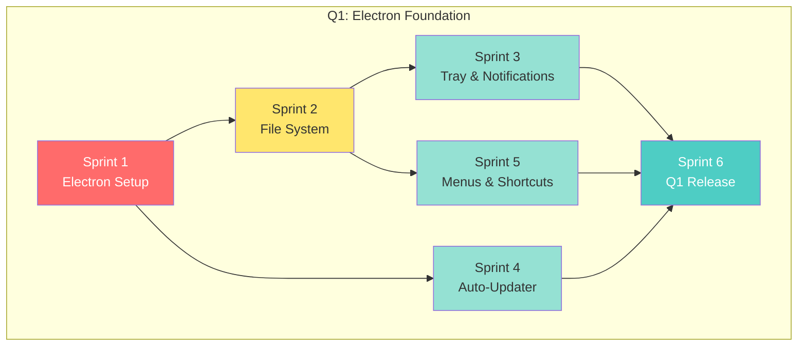
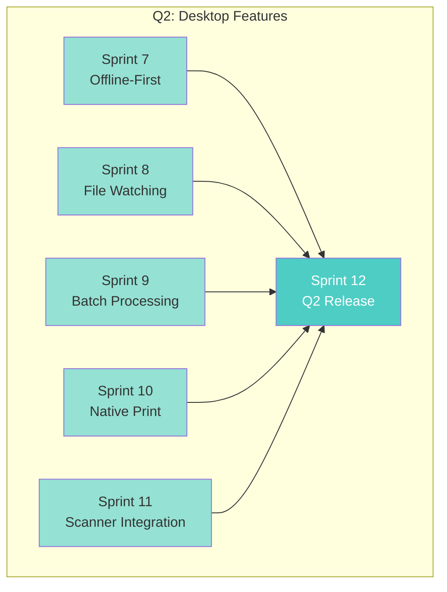
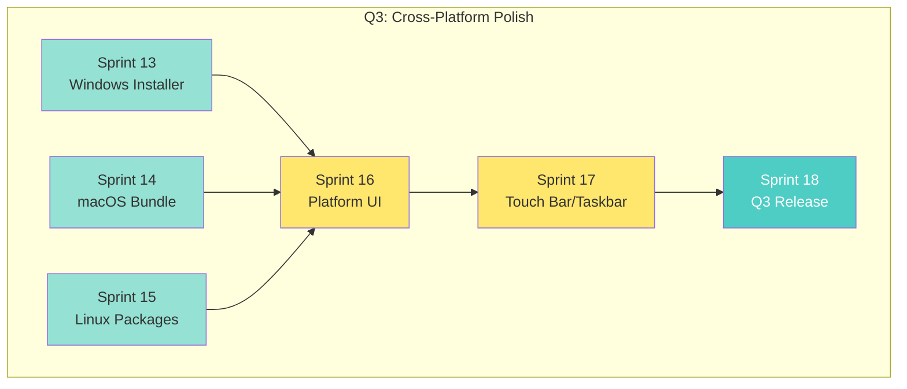
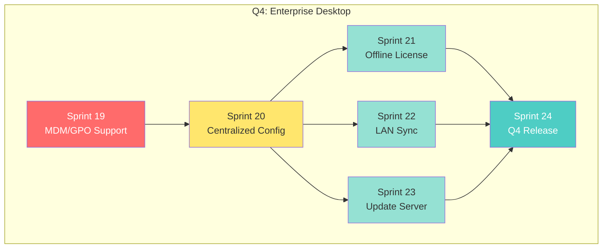

# Phase 3: Sprint Dependency Graph

This document visualizes sprint dependencies and parallelization opportunities for Phase 3 (Desktop Application).

## Overview

- **Total Sprints**: 24
- **Total Estimated Hours**: 2,260
- **Parallelizable Sprints**: 16 of 24 (67%)
- **Potential Time Savings**: ~16 weeks with optimal parallelization

---

## Q1: Electron Foundation (Sprints 1-6)

### Dependency Graph



### Parallel Execution Plan

| Week | Track A | Track B | Track C |
|------|---------|---------|---------|
| 1-2 | Sprint 1 | - | - |
| 3-4 | Sprint 2 | Sprint 4 | - |
| 5-6 | Sprint 3 | Sprint 5 | - |
| 7-8 | Sprint 6 | - | - |

**Time**: 8 weeks (vs 12 weeks sequential)

---

## Q2: Desktop Features (Sprints 7-12)

### Dependency Graph



### Parallel Execution Plan

| Week | Track A | Track B | Track C | Track D | Track E |
|------|---------|---------|---------|---------|---------|
| 1-2 | Sprint 7 | Sprint 8 | Sprint 9 | Sprint 10 | Sprint 11 |
| 3-4 | Sprint 12 | - | - | - | - |

**Time**: 4 weeks (vs 12 weeks sequential) - **67% time savings!**

---

## Q3: Cross-Platform Polish (Sprints 13-18)

### Dependency Graph



### Parallel Execution Plan

| Week | Windows Team | macOS Team | Linux Team | Integration |
|------|--------------|------------|------------|-------------|
| 1-2 | Sprint 13 | Sprint 14 | Sprint 15 | - |
| 3-4 | - | - | - | Sprint 16 |
| 5-6 | - | - | - | Sprint 17 |
| 7-8 | - | - | - | Sprint 18 |

**Time**: 8 weeks (vs 12 weeks sequential)

---

## Q4: Enterprise Desktop (Sprints 19-24)

### Dependency Graph



### Parallel Execution Plan

| Week | Track A | Track B | Track C |
|------|---------|---------|---------|
| 1-2 | Sprint 19 | - | - |
| 3-4 | Sprint 20 | - | - |
| 5-6 | Sprint 21 | Sprint 22 | Sprint 23 |
| 7-8 | Sprint 24 | - | - |

**Time**: 8 weeks (vs 12 weeks sequential)

---

## Full Year Timeline Comparison

### Sequential Execution (Original)

```
Q1: [S1]→[S2]→[S3]→[S4]→[S5]→[S6] = 12 weeks
Q2: [S7]→[S8]→[S9]→[S10]→[S11]→[S12] = 12 weeks
Q3: [S13]→[S14]→[S15]→[S16]→[S17]→[S18] = 12 weeks
Q4: [S19]→[S20]→[S21]→[S22]→[S23]→[S24] = 12 weeks
─────────────────────────────────────────────────
TOTAL: 48 weeks
```

### Optimized Parallel Execution

```
Q1: [S1]→[S2,S4]→[S3,S5]→[S6] = 8 weeks
Q2: [S7,S8,S9,S10,S11]→[S12] = 4 weeks
Q3: [S13,S14,S15]→[S16]→[S17]→[S18] = 8 weeks
Q4: [S19]→[S20]→[S21,S22,S23]→[S24] = 8 weeks
─────────────────────────────────────────────────
TOTAL: 28 weeks (42% time savings!)
```

---

## Legend

| Color | Meaning |
|-------|---------|
| 🔴 Red | Foundation/blocking sprint |
| 🟡 Yellow | Sequential dependency |
| 🟢 Green | Parallelizable sprint |
| 🔵 Cyan | Release/milestone sprint |

---

## Team Allocation Recommendations

### Minimum Teams Required

| Quarter | Teams Needed | Specialization |
|---------|--------------|----------------|
| Q1 | 2 | Core Electron, Auto-Update |
| Q2 | 5 | Offline, File Watch, Batch, Print, Scanner |
| Q3 | 3 | Windows, macOS, Linux |
| Q4 | 3 | Enterprise, LAN, Update Server |

### Optimal Configuration

- **2-3 full-time developers** can achieve most parallelization
- **5 developers** for maximum Q2 parallelization
- **Platform specialists** for Q3 (Windows, macOS, Linux)

---

## Sprint Parallel Groups

For reference when updating sprint files:

| Sprint | canParallelWith | blockedBy |
|--------|-----------------|-----------|
| 1 | - | Phase 2 |
| 2 | 4 | 1 |
| 3 | 5 | 2 |
| 4 | 2 | 1 |
| 5 | 3 | 2 |
| 6 | - | 3,4,5 |
| 7 | 8,9,10,11 | 6 |
| 8 | 7,9,10,11 | 6 |
| 9 | 7,8,10,11 | 6 |
| 10 | 7,8,9,11 | 6 |
| 11 | 7,8,9,10 | 6 |
| 12 | - | 7,8,9,10,11 |
| 13 | 14,15 | 12 |
| 14 | 13,15 | 12 |
| 15 | 13,14 | 12 |
| 16 | - | 13,14,15 |
| 17 | - | 16 |
| 18 | - | 17 |
| 19 | - | 18 |
| 20 | - | 19 |
| 21 | 22,23 | 20 |
| 22 | 21,23 | 20 |
| 23 | 21,22 | 20 |
| 24 | - | 21,22,23 |
