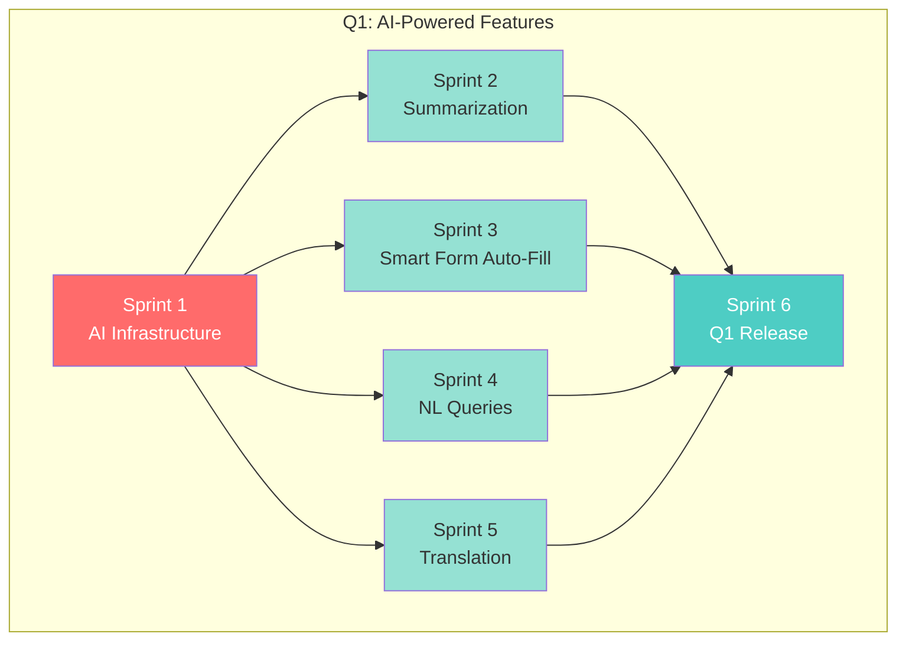
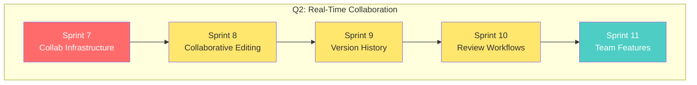
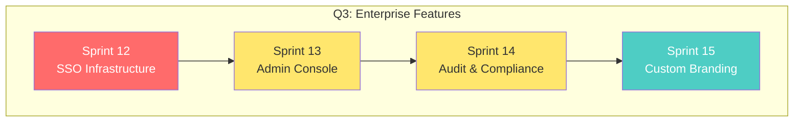
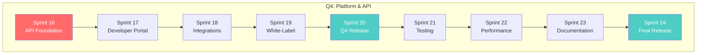

# Phase 4: Sprint Dependency Graph

This document visualizes sprint dependencies and parallelization opportunities for Phase 4 (AI, Collaboration, Enterprise & Platform).

## Overview

- **Total Sprints**: 24
- **Total Estimated Hours**: 3,049
- **Parallelizable Sprints**: 4 of 24 (17%)
- **Structure**: Highly sequential with Q1 AI features being the main parallelization opportunity

---

## Q1: AI-Powered Features (Sprints 1-6)

### Dependency Graph



### Parallel Execution Plan

| Week | Track A | Track B | Track C | Track D |
|------|---------|---------|---------|---------|
| 1-2 | Sprint 1 | - | - | - |
| 3-4 | Sprint 2 | Sprint 3 | Sprint 4 | Sprint 5 |
| 5-6 | Sprint 6 | - | - | - |

**Time**: 6 weeks (vs 12 weeks sequential) - **50% time savings!**

---

## Q2: Real-Time Collaboration (Sprints 7-11)

### Dependency Graph



### Execution Plan

| Week | Sprint |
|------|--------|
| 1-2 | Sprint 7 (Infrastructure) |
| 3-4 | Sprint 8 (Editing) |
| 5-6 | Sprint 9 (Versioning) |
| 7-8 | Sprint 10 (Reviews) |
| 9-10 | Sprint 11 (Team + Release) |

**Time**: 10 weeks (strictly sequential - each sprint builds on the previous)

**Note**: Q2 is sequential because:
- Sprint 8 requires CRDT infrastructure from Sprint 7
- Sprint 9 requires editing sync from Sprint 8
- Sprint 10 requires version history from Sprint 9
- Sprint 11 integrates all prior features

---

## Q3: Enterprise Features (Sprints 12-15)

### Dependency Graph



### Execution Plan

| Week | Sprint |
|------|--------|
| 1-2 | Sprint 12 (SSO) |
| 3-4 | Sprint 13 (Admin) |
| 5-6 | Sprint 14 (Audit) |
| 7-8 | Sprint 15 (Branding + Release) |

**Time**: 8 weeks (strictly sequential)

**Note**: Q3 is sequential because:
- Admin Console (13) manages SSO configuration from Sprint 12
- Audit (14) logs actions from the Admin Console
- Branding (15) requires audit infrastructure for compliance

---

## Q4: Platform & API (Sprints 16-24)

### Dependency Graph



### Execution Plan

| Week | Sprint | Focus |
|------|--------|-------|
| 1-2 | Sprint 16 | API Foundation |
| 3-4 | Sprint 17 | Developer Portal |
| 5-6 | Sprint 18 | Integrations Marketplace |
| 7-8 | Sprint 19 | White-Label |
| 9-10 | Sprint 20 | Platform Polish & v4.5 Release |
| 11-12 | Sprint 21 | Testing & Coverage |
| 13-14 | Sprint 22 | Performance Optimization |
| 15-16 | Sprint 23 | Documentation |
| 17-18 | Sprint 24 | Final Testing & v5.0 Release |

**Time**: 18 weeks (strictly sequential)

---

## Full Year Timeline Comparison

### Sequential Execution

```
Q1: [S1]→[S2]→[S3]→[S4]→[S5]→[S6] = 12 weeks
Q2: [S7]→[S8]→[S9]→[S10]→[S11] = 10 weeks
Q3: [S12]→[S13]→[S14]→[S15] = 8 weeks
Q4: [S16]→[S17]→[S18]→[S19]→[S20]→[S21]→[S22]→[S23]→[S24] = 18 weeks
─────────────────────────────────────────────────────────────────
TOTAL: 48 weeks
```

### Optimized Parallel Execution

```
Q1: [S1]→[S2,S3,S4,S5]→[S6] = 6 weeks
Q2: [S7]→[S8]→[S9]→[S10]→[S11] = 10 weeks (no change)
Q3: [S12]→[S13]→[S14]→[S15] = 8 weeks (no change)
Q4: [S16]→[S17]→[S18]→[S19]→[S20]→[S21]→[S22]→[S23]→[S24] = 18 weeks (no change)
─────────────────────────────────────────────────────────────────
TOTAL: 42 weeks (12% time savings)
```

---

## Why Phase 4 is More Sequential

Phase 4 features have **inherent dependencies** that prevent parallelization:

### 1. AI Features (Q1) - Partially Parallelizable
- All AI features depend on the same LLM infrastructure (Sprint 1)
- Once infrastructure is ready, features are independent
- **4 sprints can run in parallel**

### 2. Collaboration (Q2) - Strictly Sequential
- Each feature builds on the previous:
  - Can't have collaborative editing without CRDT sync
  - Can't have version history without knowing what was edited
  - Can't have review workflows without version history
- **Must be sequential**

### 3. Enterprise (Q3) - Strictly Sequential
- Security features have strict dependencies:
  - Admin Console manages SSO settings
  - Audit logs Admin Console actions
  - Branding requires audit trail for compliance
- **Must be sequential**

### 4. Platform (Q4) - Strictly Sequential
- API platform is layered:
  - Developer Portal documents the API
  - Integrations use the API
  - White-label wraps everything
- **Must be sequential**

---

## Comparison: Phase 3 vs Phase 4

| Aspect | Phase 3 (Desktop) | Phase 4 (AI/Cloud) |
|--------|-------------------|-------------------|
| Total Sprints | 24 | 24 |
| Parallelizable | 16 (67%) | 4 (17%) |
| Sequential | 8 (33%) | 20 (83%) |
| Time (Sequential) | 48 weeks | 48 weeks |
| Time (Optimized) | 28 weeks | 42 weeks |
| Savings | 42% | 12% |

**Key Insight**: Phase 3 (Desktop) has more independent platform-specific work (Windows/macOS/Linux), while Phase 4 (Cloud) features have layered dependencies.

---

## Legend

| Color | Meaning |
|-------|---------|
| 🔴 Red | Foundation/blocking sprint |
| 🟡 Yellow | Sequential dependency |
| 🟢 Green | Parallelizable sprint |
| 🔵 Cyan | Release/milestone sprint |

---

## Sprint Parallel Groups

For reference when updating sprint files:

| Sprint | canParallelWith | blockedBy |
|--------|-----------------|-----------|
| 1 | - | - |
| 2 | 3,4,5 | 1 |
| 3 | 2,4,5 | 1 |
| 4 | 2,3,5 | 1 |
| 5 | 2,3,4 | 1 |
| 6 | - | 2,3,4,5 |
| 7 | - | 6 |
| 8 | - | 7 |
| 9 | - | 8 |
| 10 | - | 9 |
| 11 | - | 10 |
| 12 | - | 11 |
| 13 | - | 12 |
| 14 | - | 13 |
| 15 | - | 14 |
| 16 | - | 15 |
| 17 | - | 16 |
| 18 | - | 17 |
| 19 | - | 18 |
| 20 | - | 19 |
| 21 | - | 20 |
| 22 | - | 21 |
| 23 | - | 22 |
| 24 | - | 23 |

---

## Team Allocation Recommendations

### Minimum Teams Required

| Quarter | Teams Needed | Specialization |
|---------|--------------|----------------|
| Q1 | 4 | Summarization, Forms, NL Queries, Translation |
| Q2 | 1 | Collaboration (sequential work) |
| Q3 | 1 | Enterprise (sequential work) |
| Q4 | 1 | Platform (sequential work) |

### Optimal Configuration

- **Q1**: 4 parallel tracks after Sprint 1 completes
- **Q2-Q4**: Single team working sequentially (allows other resources to work on Phase 3)

### Cross-Phase Optimization

Since Phase 4 Q2-Q4 are sequential, resources can be shared with Phase 3:
- Phase 3 Q2 (5 parallel sprints) can absorb extra developers
- Phase 3 Q3 (platform installers) can use freed-up resources
